+++
date = "2016-07-29T16:18:23+05:30"
draft = true
title = "Build a Battle Station Manager App using Lightning Components"

+++

## Introduction
In this project, you learn how to build an application using the Lightning Component framework for the Lightning Experience desktop UI and the Salesforce1 mobile app. We will build an app to manage the construction of Battle Stations on a single page. This is an extension of the <a href="https://trailhead.salesforce.com/project/workshop-battle-station" target="_blank">Battle Station Trailhead project</a>. However, you don't have to necessarily complete the project before this workshop as you can install the metadata from the project using an unmanaged package.

Once we are done with creating the App, it will look like this:

#### Component breakup
1. `BattleStationsList` component
2. `BattleStationItem` component
3. `BattleStationDetail` component
4. `ResourceList` component
5. `SupplyList` component
6. `StationRelatedLists` component
7. standard *Report Chart* component

You will use your Salesforce Developer Edition org for this workshop. If you don't have a Developer Edition account, please <a href="https://developer.salesforce.com/signup" target="_blank">Signup</a>

#### Here are the steps involved in creating our app:

* [Install the unmanaged package](#step1)
* [Create a server-side Apex utility class](#step2)
* [Create a BattleStationsList component](#step3)
* [Create a BattleStationItem component](#step4)
* [Create a BattleStationDetail component](#step5)
* [Create BattleStationRelatedItems, ResourceList and SupplyList components](#step6)
* [Create the lightning page and tab with these components](#step7)
* [Add functionality with Lightning Events](#step8)
* [Open the App and try it out!](#step9)

### <a name="step1"></a>Step 1: Install the unmanaged package

#### What you'll do
You will install the unmanaged package in your Developer Edition org.

1. <a href="https://login.salesforce.com/packaging/installPackage.apexp?p0=04t28000000HAQs" target="_blank">Click here to install</a> the unmanaged package to get the Battle Station app metadata.
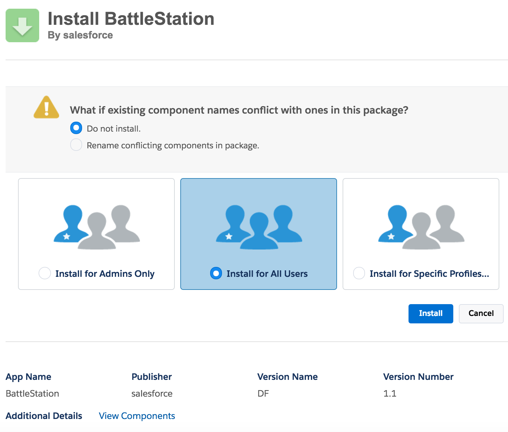

2. Observe and understand the setup, i.e., the custom objects, fields and the report that are installed by the package, either in the Lightning Schema Builder or directly in the Setup. If you are using the Schema Builder, click "Clear All" in the object selection panel and select the Objects "Battle Station", "Resource" and "Supply". Schema Builder can be found by searching for "schema builder" in the Setup search.

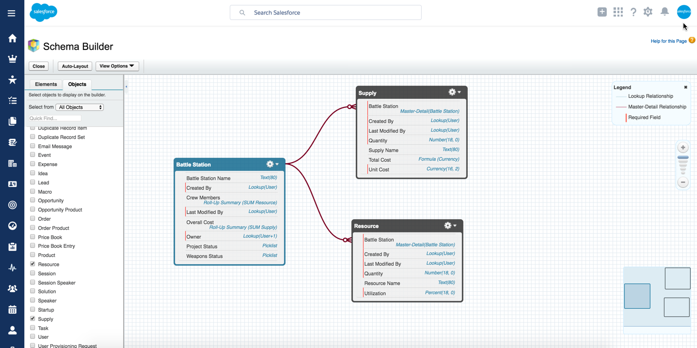


### <a name="step2"></a>Step 2: Create a server-side Apex utility class

#### What you'll do
You will create a new Apex class which will contain lightning enabled methods that can be called by components for server-side data.

1. Open the developer console from Setup > Developer Console.
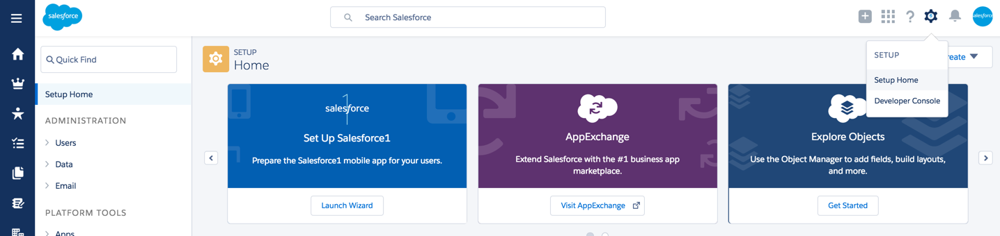

2. In the developer console, click *File > New > Apex Class*, give it a name `BattleStationUtil`, and click Ok to see the newly created skeletal Apex class.
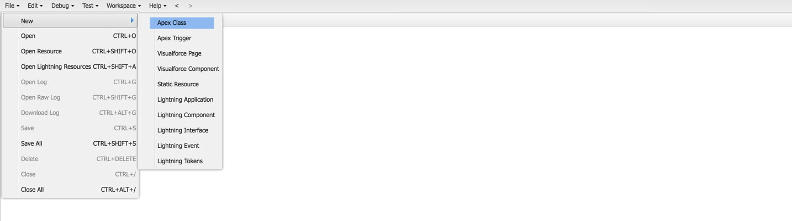


3. Clear the default code and replace with below code, and click *File > Save*:
	```java
	public class BattleStationUtil {
		@auraEnabled
	    public static list<battle_station__c> getStations(){
	        return [select id,name,project_status__c,weapons_status__c from battle_station__c order by createdDate desc];
	    }
	    @auraEnabled
	    public static list<resource__c> getResources(string stationId){
	        return [select name, utilization__c, quantity__c from resource__c where battle_station__c = :stationId order by createdDate desc];
	    }
	    @auraEnabled
	    public static list<supply__c> getSupplies(string stationId){
	        return [select name, unit_cost__c, quantity__c, total_cost__c from supply__c where battle_station__c = :stationId order by createdDate];
	    }
	    @auraEnabled
	    public static Battle_Station__c createStation(string name, string projectStatus, string weaponsStatus){
	        battle_station__c station = new battle_station__c();
	        station.Name = name;
	        station.Project_Status__c = projectStatus;
	        station.Weapons_Status__c = weaponsStatus;
	        insert station;
	        return [select id, name, project_status__c, weapons_status__c from battle_station__c order by createdDate desc limit 1];
	    }
	    @auraEnabled
	    public static Battle_Station__c deleteStation(String Id) {
	        battle_station__c station = [select id from battle_station__c where id = :Id];
	        delete station;
	        return station;
	    }
	    @auraEnabled
	    public static Supply__c insertSupply(string name, integer unitCost, integer quantity, string stationId){
	        supply__c supply = new supply__c();
	        supply.name = name;
	        supply.Battle_Station__c = stationId;
	        supply.Quantity__c = quantity;
	        supply.Unit_Cost__c = unitCost;
	        insert supply;
	        return supply;
	    }
	    @auraEnabled
	    public static Resource__c insertResource(string name, integer utilization, integer quantity, string stationId){
	        Resource__c resource = new Resource__c();
	        resource.name = name;
	        resource.Battle_Station__c = stationId;
	        resource.Quantity__c = quantity;
	        resource.Utilization__c = utilization;
	        insert resource;
	        return resource;
	    }
	}
	```


### <a name="step3"></a>Step 3: Create a BattleStationsList component

#### What you'll do
You will create a new Lightning component which will show a list of current Battle Stations and lets you create new Battle Stations.

1. In the developer console, click *File > New > Lightning Component*, give it a name `BattleStationsList`, select Component Configuration checkbox for *Lightning Page*, and click Submit to see the newly created skeletal component bundle.


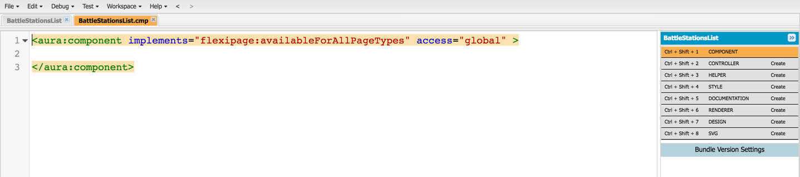

2. Clear the default markup code and replace with below code, and click *File > Save*:
	```html
	<aura:component implements="flexipage:availableForAllPageTypes" access="global" controller="BattleStationUtil">
	    
	    <aura:attribute name="stations" type="Battle_Station__c[]"/>
	    
	    <aura:handler name="init" value="{!this}" action="{!c.loadStations}"/>
	    
	    <div class="slds-align--absolute-center">
	        <p class="slds-text-heading--label">Click any Battle Station to view or edit details</p>
	    </div>
	    <div class="slds-align--absolute-center">
	        <ui:button aura:id="new" label="Create new Battle Station" press="{!c.loadNew}"/>
	        <br/>
	    </div>
	    <table class="myClass slds-table slds-table--bordered slds-table--cell-buffer">
	        <thead>
	            <tr class="slds-text-heading--label">
	                <th scope="col">
	                    <div class="slds-truncate" title="Battle Station Name">Battle Station Name</div>
	                </th>
	                <th scope="col">
	                    <div class="slds-truncate" title="Project Status">Project Status</div>
	                </th>
	                <th scope="col">
	                    <div class="slds-truncate" title="Weapons Status">Weapons Status</div>
	                </th>         
	            </tr>
	        </thead>
	        <tbody>
	            <aura:iteration items="{!v.stations}" var="station">

	            </aura:iteration>
	        </tbody>
	    </table>
	    
	</aura:component>
	```

3. Click on *Controller* in the right panel to open the client-side javascript controller section of the bundle.

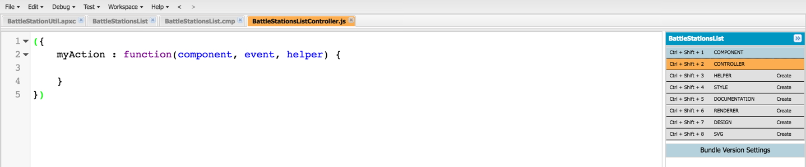

4. Clear the default Javascript code and replace with below code, and Save:
	```javascript
	({
		loadStations : function(component, event, helper) {
			var action = component.get("c.getStations");
	        action.setCallback(this, function(response){
	            if(response.getState()==="SUCCESS" && component.isValid()){
	                component.set("v.stations",response.getReturnValue());
	            }
	        });
	        $A.enqueueAction(action);
		},
	    loadNew : function(component, event, helper) {
	        var loadEvent = $A.get("e.c:StationClickEvent");
	        loadEvent.setParams({"new":true});
	        loadEvent.fire();
		},
	})
	```
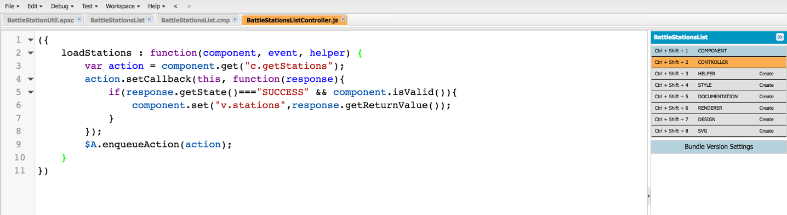


### <a name="step4"></a>Step 4: Create a BattleStationItem component

#### What you'll do
You will create another Lightning component which shows a a single Battle Station's details as a row in the BattleStationsList component.

1. In the developer console, click *File > New > Lightning Component*, give it a name `BattleStationItem`, select Component Configuration checkbox for *Lightning Page*, and click Submit to see the newly created skeletal component bundle. For navigation help, refer to screenshots from Step 3.

2. Clear the default markup code and replace with below code, and click *File > Save*:
	```html
	<aura:component implements="flexipage:availableForAllPageTypes" access="GLOBAL">
	    
	    <aura:attribute name="stationItem" type="Battle_Station__c" access="global"/>
	    
	    <tr >
	      <th scope="row" data-label="Battle Station Name" >
	        <div class="slds-truncate"><a href="javascript:void(0);"><p onclick="{!c.loadDetail}">{!v.stationItem.Name}</p></a></div>
	      </th>
	      <td data-label="Project Status">
	        <div class="slds-truncate">{!v.stationItem.Project_Status__c}</div>
	      </td>
	      <td data-label="Weapons Status">
	        <div class="slds-truncate">{!v.stationItem.Weapons_Status__c}</div>
	      </td>
	    </tr>
	    
	</aura:component>
	```

3. Add this new component to the previous BattleStationsList component's markup. To do so, open the `BattleStationsList` component markup and add the following line of markup inside the `aura:iteration` component.
	```html
	<c:BattleStationItem stationItem="{!station}"/>
	```


### <a name="step5"></a>Step 5: Create a BattleStationDetail component

#### What you'll do
You will create a lightning component which displays the details of a Battle Station record and lets you edit and delete the record, or create a new record.

1. In the developer console, click *File > New > Lightning Component*, give it a name `BattleStationItem`, select Component Configuration checkbox for *Lightning Page*, and click Submit to see the newly created skeletal component bundle. For navigation help, refer to screenshots from Step 3.

2. Clear the default markup code and replace with below code, and click *File > Save*:
	```html
	<aura:component implements="flexipage:availableForAllPageTypes" access="GLOBAL" controller="BattleStationUtil">
	    
	    <aura:handler name="onSaveSuccess" event="force:recordSaveSuccess" action="{!c.saveSuccess}"/>
	    
	    <aura:attribute type="Battle_Station__c" name="station" access="global" default="{'sobjectType':'Battle_Station__c'}"/>
	    <aura:attribute type="Boolean" name="editView" default="false"/>
	    <aura:attribute type="Boolean" name="createView" default="false"/>
	    <aura:attribute type="Boolean" name="detailView" default="false"/>
	    
	    <aura:if isTrue="{! v.createView }">
	        <div class="slds-align--absolute-center">
	            <ui:button aura:id="save" label="Save" press="{!c.insertStation}"/>
	            <ui:button aura:id="cancel" label="Cancel" press="{!c.cancelCreate}"/>
	        </div>
	        <ui:inputText label="Battle Station name" value="{!v.station.Name}" required="true"/>
	        <ui:inputSelect label="Project Status" value="{!v.station.Project_Status__c}" required="true">
	            <ui:inputSelectOption text="Green" label="Green"/>
	            <ui:inputSelectOption text="Yellow" label="Yellow" />
	            <ui:inputSelectOption text="Red" label="Red"/>
	            <ui:inputSelectOption text="Complete" label="Complete"/>
	        </ui:inputSelect>
	        <ui:inputSelect label="Weapons Status" value="{!v.station.Weapons_Status__c}" required="true">
	            <ui:inputSelectOption text="Not Yet Operational" label="Not Yet Operational"/>
	            <ui:inputSelectOption text="Fully Operational" label="Fully Operational"/>
	        </ui:inputSelect>
	    </aura:if>
	    
	    <aura:if isTrue="{! v.detailView }">
	        <div class="slds-align--absolute-center">
	            <ui:button aura:id="edit" label="Edit" press="{!c.makeEdit}"/>
	            <ui:button aura:id="delete" label="Delete" press="{!c.removeStation}"/>
	        </div>
	        <force:recordView aura:id="record" recordId="{!v.station.Id}"/>
	    </aura:if>
	    
	    <aura:if isTrue="{! v.editView }">
	        <div class="slds-align--absolute-center">
	            <ui:button aura:id="save" label="Save" press="{!c.saveStation}"/>
	            <ui:button aura:id="cancel" label="Cancel" press="{!c.cancelEdit}"/>
	        </div>
	        <force:recordEdit aura:id="recedit" recordId="{!v.station.Id}"/>
	    </aura:if>
	    
	</aura:component>
	```

3. Click on *Controller* in the right panel to open the client-side javascript controller section of the bundle. For navigation help, refer to screenshots from Step 3.

4. Clear the default Javascript code and replace with below code, and Save:
	```javascript
	({
	    showStation : function(component, event, helper) {
	        var newView = event.getParam("new");
	        var station = event.getParam("station");
	        component.set("v.station",station);
	        if (newView) {
	            helper.toggleView(component, "create");  
	        } else {
	            helper.toggleView(component, "detail");
	        }
	    },
	    makeEdit : function(component, event, helper) {
	        helper.toggleView(component, "edit");
	    },
	    saveStation : function(component, event, helper) {       
	        component.find("recedit").get("e.recordSave").fire();
		},
	    saveSuccess : function(component, event, helper) {
	        $A.get("e.c:updatedListEvent").fire();
	        helper.toggleView(component, "detail");       
	    },
	    cancelEdit : function(component, event, helper) {
	        helper.toggleView(component, "detail");
	    },
	    cancelCreate : function(component, event, helper) {
	        helper.toggleView(component, "none");
	    },
	    makeNew : function(component, event, helper) {
	        helper.toggleView(component, "create");
	    },
	    insertStation : function(component, event, helper) {
	        var action = component.get("c.createStation");
	        var station = component.get("v.station");
	        action.setParams({
	            "name" : station.Name,
	            "projectStatus" : station.Project_Status__c,
	            "weaponsStatus" : station.Weapons_Status__c
	        });
	        action.setCallback(this, function(response){
	            $A.get("e.c:updatedListEvent").fire();
	            $A.get("e.c:StationClickEvent").setParams({"new":false,"station":response.getReturnValue()}).fire();
	            helper.toggleView(component, "detail");
	        });
	        $A.enqueueAction(action);
	    },
	    removeStation : function(component, event, helper) {
	        var action = component.get("c.deleteStation");
	        action.setParams({"Id":component.get("v.station").Id});
	        action.setCallback(this, function(response){
	            $A.get("e.force:showToast").setParams({"message":"Battle Station Deleted","duration":"2500"}).fire();
	            helper.toggleView(component, "none");
	            $A.get("e.c:updatedListEvent").fire();
	        })
	        $A.enqueueAction(action);
	    },
	})
	```

5. Click on *Helper* in the right panel to open the client-side javascript controller section of the bundle.
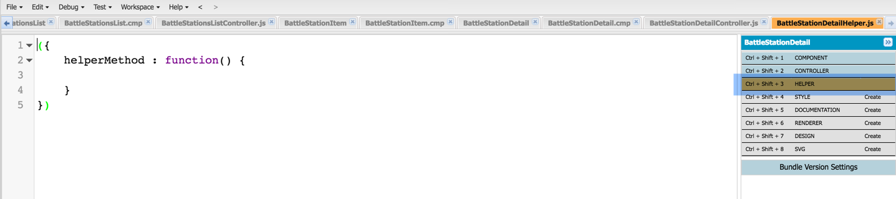

6. Clear the default Javascript code and replace with below code, and Save:
	```js
	({
		toggleView : function(component, view) {
			component.set("v.createView",false);
	        component.set("v.detailView",false);
	        component.set("v.editView",false);
	        
	        if ( view === "create" ) component.set("v.createView",true);
	        if ( view === "edit" ) component.set("v.editView",true);
	        if ( view === "detail" ) component.set("v.detailView",true);
		}
	})
	```


### <a name="step6"></a>Step 6: Create BattleStationRelatedItems, ResourceList and SupplyList components

#### What you'll do
You will create components to show related Related Resources and Supplies and another BattleStationRelatedItems component which contains the list components.

1. In the developer console, click *File > New > Lightning Component*, give it a name `ResourceList`, select Component Configuration checkbox for *Lightning Page*, and click Submit to see the newly created skeletal component bundle. For navigation help, refer to screenshots from Step 3.

2. Clear the default markup code and replace with below code, and click *File > Save*:
	```html
	<aura:component implements="flexipage:availableForAllPageTypes" access="global" controller="BattleStationUtil">
  
	    <aura:attribute name="station" type="Battle_Station__c"/>
	    <aura:attribute name="resources" type="Resource__c[]"/>
	    <aura:attribute name="newResource" type="Resource__c" default="{'sobjectType':'Resource__c'}"/>
	    <aura:attribute name="createView" type="Boolean"/>
	    
	    <aura:handler name="init" value="{!this}" action="{!c.loadResources}"/>
	    <aura:handler name="change" value="{!v.station}" action="{!c.loadResources}"/>
		
	    <ui:button aura:id="new" label="Create New" press="{!c.createView}"/>
	    <aura:if isTrue="{!v.createView}">
	        <ui:inputText label="Resource name:" value="{!v.newResource.Name}" required="true"/>
	        <ui:inputText label="Quantity:" value="{!v.newResource.Quantity__c}" required="true"/>
	        <ui:inputText label="Utilization: %" value="{!v.newResource.Utilization__c}" required="true"/>
	        <ui:button label="Save" press="{!c.createResource}"/>
	        <ui:button label="Cancel" press="{!c.cancelSave}"/>
	    </aura:if>
	    <ul class="slds-has-dividers--around-space">
	        <aura:iteration items="{!v.resources}" var="resource">
	        <li class="slds-item">
	            <div class="slds-tile slds-tile--board">
	                <h3 class="slds-truncate slds-text-heading--medium" title="Anypoint Connectors"><a href="javascript:void(0);">{!resource.Name}</a></h3>
	                <div class="slds-tile__detail slds-text-body--small">
	                    <p class="slds-text-heading--medium">Quantity: {!resource.Quantity__c}</p>
	                    <p class="slds-truncate">Utilization: {!resource.Utilization__c}%</p>
	                </div>
	            </div>
	        </li>
	        </aura:iteration>
	    </ul>

	</aura:component>
	```

3. Click on *Controller* in the right panel to open the client-side javascript controller section of the bundle. For navigation help, refer to screenshots from Step 3.

4. Clear the default Javascript code and replace with below code, and Save:
	```javascript
	({
		loadResources : function(component, event, helper) {
			var action = component.get("c.getResources");
	        action.setParams({
	            "stationId" : component.get("v.station").Id
	        });
	        action.setCallback(this, function(response){
	            if(response.getState()==="SUCCESS" && component.isValid()){
	                component.set("v.resources",response.getReturnValue());
	            }
	        });
	        $A.enqueueAction(action);
		},
	    createView : function(component, event, helper) {
	        component.set("v.createView",true);
	    },
	    cancelSave : function(component, event, helper) {
	        component.set("v.createView",false);
	    },
	    createResource : function(component, event, helper) {
	        var action = component.get("c.insertResource");
	        var supply = component.get("v.newResource");
	        action.setParams({
	            "name" : supply.Name,
	            "utilization" : supply.Utilization__c,
	            "quantity" : supply.Quantity__c,
	            "stationId" : component.get("v.station").Id
	        });
	        action.setCallback(this, function(response){
	            if(response.getState()==="SUCCESS" && component.isValid()) {
	                component.set("v.createView",false);
	            	$A.get("e.c:StationClickEvent").setParams({"new":false,"station":component.get("v.station")}).fire();
	            }
	        });
	        
	        $A.enqueueAction(action);
	    }
	})
	```

5. In the developer console, click *File > New > Lightning Component*, give it a name `SupplyList`, select Component Configuration checkbox for *Lightning Page*, and click Submit to see the newly created skeletal component bundle. For navigation help, refer to screenshots from Step 3.

6. Clear the default markup code and replace with below code, and click *File > Save*:
	```html
	<aura:component implements="flexipage:availableForAllPageTypes" access="global" controller="BattleStationUtil">
    
	    <aura:attribute name="station" type="Battle_Station__c"/>
	    <aura:attribute name="supplies" type="Supply__c[]"/>
	    <aura:attribute name="newSupply" type="Supply__c" default="{'sobjectType':'Supply__c'}"/>
	    <aura:attribute name="createView" type="Boolean"/>
	    
	    <aura:handler name="init" value="{!this}" action="{!c.loadSupplies}"/>
	    <aura:handler name="change" value="{!v.station}" action="{!c.loadSupplies}"/>
		
	    <ui:button aura:id="new" label="Create New" press="{!c.createView}"/>
	    <aura:if isTrue="{!v.createView}">
	        <ui:inputText label="Supply name:" value="{!v.newSupply.Name}" required="true"/>
	        <ui:inputText label="Unit Cost: $" value="{!v.newSupply.Unit_Cost__c}" required="true"/>
	        <ui:inputText label="Quantity:" value="{!v.newSupply.Quantity__c}" required="true"/>
	        <ui:button label="Save" press="{!c.createSupply}"/>
	        <ui:button label="Cancel" press="{!c.cancelSave}"/>
	    </aura:if>
	    <ul class="slds-has-dividers--around-space">
	        <aura:iteration items="{!v.supplies}" var="supply">
	        <li class="slds-item">
	            <div class="slds-tile slds-tile--board">
	                <h3 class="slds-truncate slds-text-heading--medium" title="Anypoint Connectors"><a href="javascript:void(0);">{!supply.Name}</a></h3>
	                <div class="slds-tile__detail slds-text-body--small">
	                    <p class="slds-text-heading--medium">Quantity: {!supply.Quantity__c}</p>
	                    <p class="slds-truncate">Unit Cost:  ${!supply.Unit_Cost__c}</p>
	                    <p class="slds-truncate">Total Cost: ${!supply.Total_Cost__c}</p>
	                </div>
	            </div>
	        </li>
	        </aura:iteration>
	    </ul>

	</aura:component>
	```

7. Click on *Controller* in the right panel to open the client-side javascript controller section of the bundle. For navigation help, refer to screenshots from Step 3.

8. Clear the default Javascript code and replace with below code, and Save:
	```javascript
	({
		loadSupplies : function(component, event, helper) {
			var action = component.get("c.getSupplies");
	        action.setParams({
	            "stationId" : component.get("v.station").Id
	        });
	        action.setCallback(this, function(response){
	            if(response.getState()==="SUCCESS" && component.isValid()){
	                component.set("v.supplies",response.getReturnValue());
	            }
	        });
	        $A.enqueueAction(action);
		},
	    createView : function(component, event, helper) {
	        component.set("v.createView",true);
	    },
	    cancelSave : function(component, event, helper) {
	        component.set("v.createView",false);
	    },
	    createSupply : function(component, event, helper) {
	        var action = component.get("c.insertSupply");
	        var supply = component.get("v.newSupply");
	        action.setParams({
	            "name" : supply.Name,
	            "unitCost" : supply.Unit_Cost__c,
	            "quantity" : supply.Quantity__c,
	            "stationId" : component.get("v.station").Id
	        });
	        action.setCallback(this, function(response){
	        	if(response.getState()==="SUCCESS" && component.isValid()) {
	                component.set("v.createView",false);
	            	$A.get("e.c:StationClickEvent").setParams({"new":false,"station":component.get("v.station")}).fire();
	            }
	        });
	        
	        $A.enqueueAction(action);
	    }
	})
	```

9. In the developer console, click *File > New > Lightning Component*, give it a name `StationRelatedLists`, select Component Configuration checkbox for *Lightning Page*, and click Submit to see the newly created skeletal component bundle. For navigation help, refer to screenshots from Step 3.

10. Clear the default markup code and replace with below code, and click *File > Save*:
	```html
	<aura:component implements="flexipage:availableForAllPageTypes" access="global" >
    
	    <aura:attribute name="station" type="Battle_Station__c"/>
	    <aura:attribute name="show" type="Boolean" />
	    
	    <aura:if isTrue="{!v.show}">
	        <div class="slds-tabs--scoped">
	          <ul class="slds-tabs--scoped__nav" role="tablist">
	            <li aura:id="tab1" onclick="{!c.switchTab}" class="slds-tabs--scoped__item slds-text-heading--label slds-active" title="Resources" role="presentation"><a class="slds-tabs--scoped__link" href="javascript:void(0);" role="tab" tabindex="0" aria-selected="true" aria-controls="tab-scoped-1" id="tab-scoped-1__item">Resources</a></li>
	            <li aura:id="tab2" onclick="{!c.switchTab}" class="slds-tabs--scoped__item slds-text-heading--label " title="Supplies" role="presentation"><a class="slds-tabs--scoped__link" href="javascript:void(0);" role="tab" tabindex="-1" aria-selected="false" aria-controls="tab-scoped-2" id="tab-scoped-2__item">Supplies</a></li>
	          </ul>
	          <div aura:id="content1" id="tab-scoped-1" class="slds-tabs--scoped__content slds-show" role="tabpanel" aria-labelledby="tab-scoped-1__item">
	              <c:ResourceList station="{!v.station}"/>
	          </div>
	          <div aura:id="content2" id="tab-scoped-2" class="slds-tabs--scoped__content slds-hide" role="tabpanel" aria-labelledby="tab-scoped-2__item">
	              <c:SupplyList station="{!v.station}"/>
	          </div>
	        </div>
	    </aura:if> 
	    
	</aura:component>
	```

11. Click on *Controller* in the right panel to open the client-side javascript controller section of the bundle. For navigation help, refer to screenshots from Step 3.

12. Clear the default Javascript code and replace with below code, and Save:
	```javascript
	({
		showRelated : function(component, event, helper) {
			var newView = event.getParam("new");
	        if (newView) {
	            component.set("v.show",false);
	        } else {
	            var station = event.getParam("station");
	        	component.set("v.station",station);
	            component.set("v.show",true);
	        }    
		},
	    switchTab : function(component, event, helper) {
	        $A.util.toggleClass(component.find("tab1"),"slds-active");
	        $A.util.toggleClass(component.find("tab2"),"slds-active");
	        $A.util.toggleClass(component.find("content1"),"slds-show");
	        $A.util.toggleClass(component.find("content1"),"slds-hide");
	        $A.util.toggleClass(component.find("content2"),"slds-show");
	        $A.util.toggleClass(component.find("content2"),"slds-hide");
	    }
	})
	```


### <a name="step7"></a>Step 7: Create the lightning page and tab with these components 

#### What you'll do
You will use the Lightning App Builder to create a new lightning tab using the components we created plus an additional standard Report Chart component. You will then add it to the navigation menu of lightning experience.

1. Go to *Setup* and type `App Builder` in the setup search, click on it and then click *New* on the App Builder page to open the App Builder.
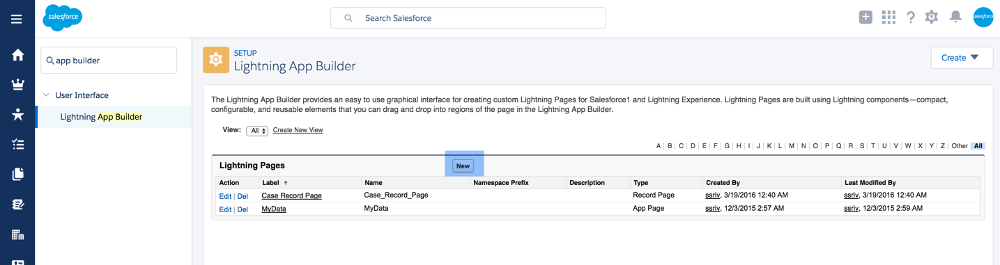

2. Click on *App Page* and click *Next*.
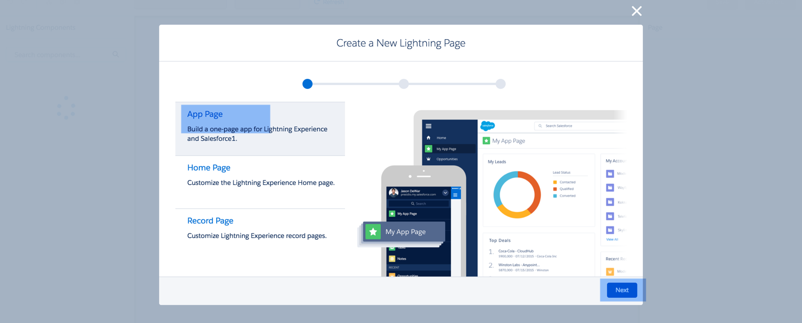

3. Click *Two Columns* and click *Next*.
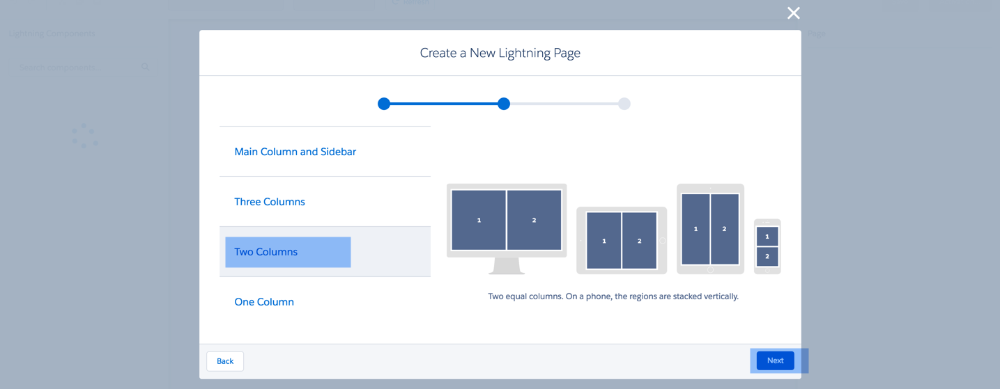

4. Enter Label as `Battle Station Manager` and click *Finish*.
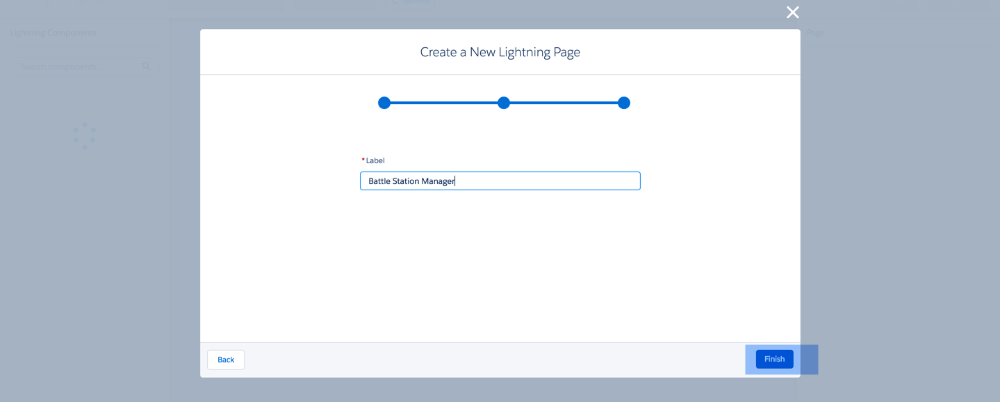

5. Select *Desktop* from the device dropdown.
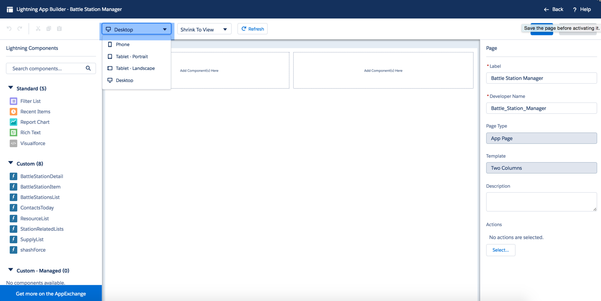

6. Drag the *BattleStationsList* component from the *Custom Components* section in the components Panel and drop it in the left column of the canvas.
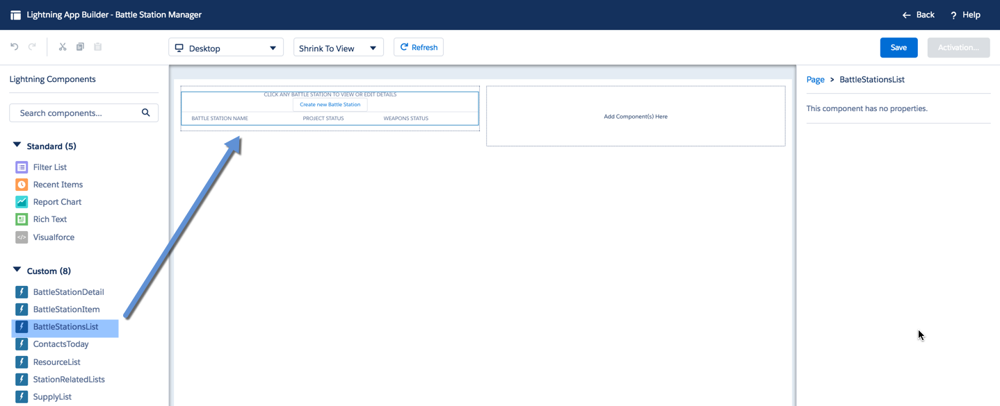

7. Drag the *BattleStationDetail* component from the *Custom Components* section in the components Panel and drop it in the right column of the canvas.
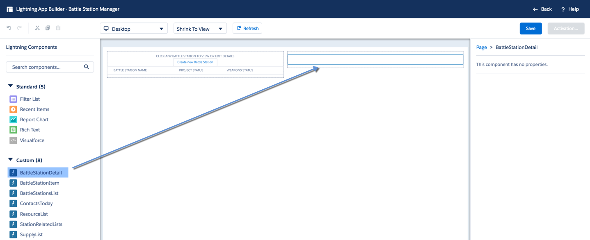

8. Drag the *StationRelatedLists* component from the *Custom Components* section in the components Panel and drop it in the right column of the canvas, below the *BattleStationDetail* component.
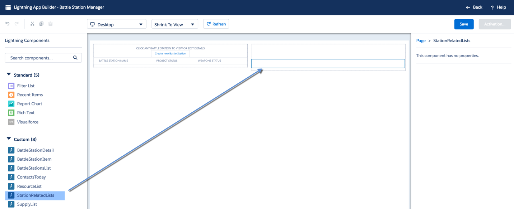

9. Drag the *Report Chart* component from the *Standard Components* section in the components Panel and drop it in the left column of the canvas, below the *BattleStationsList* component. Once dropped, on the right panel, enter *Label* as `Battle Station Supplies Chart`, check the *Show Refresh Button* option, and click *Save* on the top right.
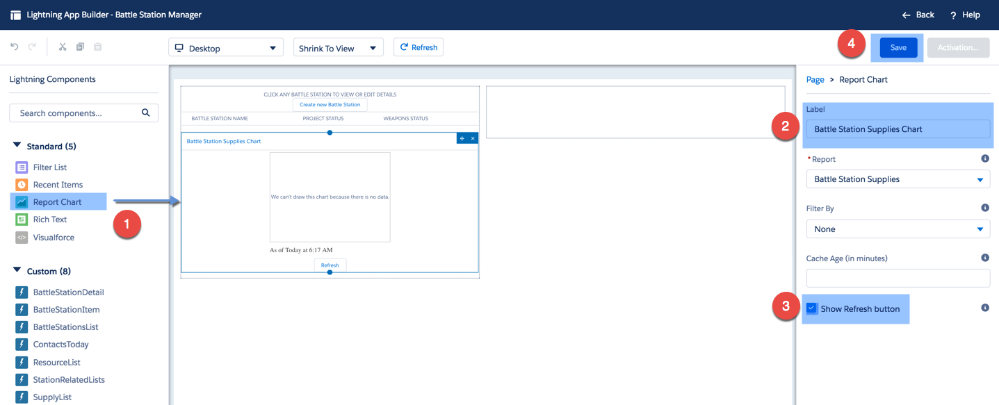

10. On the *Page Saved* popup, click *Activate*.
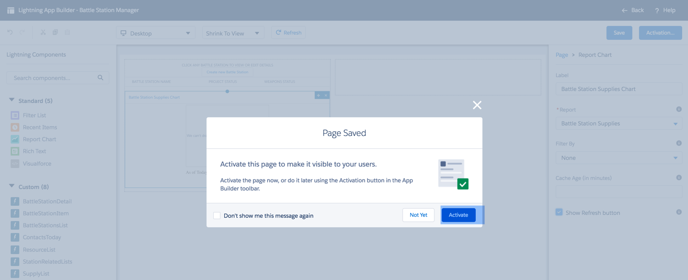

11. On the Activation page, click on the *Lightning Experience* tab.


12. Click on *Go create one!*


13. This is will the *Navigation Menus* page in a new tab. Click *New* button in the right top corner.


14. Enter *Name* as `Battle Station` and click *Next*.
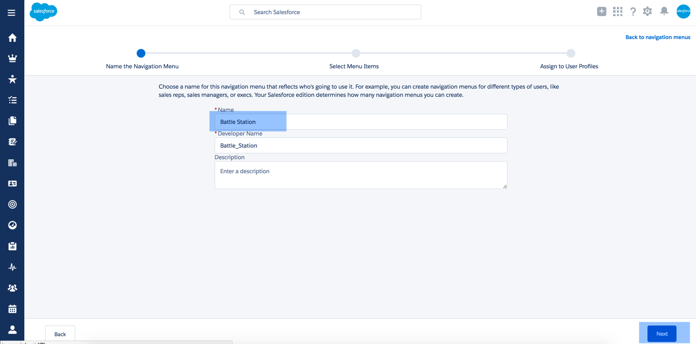

15. Add the *Home* and *Battle Stations* tabs under *Navigation Menu items* and click *Next*.
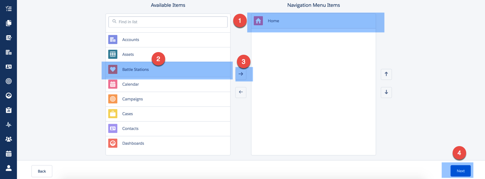

16. Select "System Administrator" profile and add it to the *Selected Profiles* list, and click *Save & Finish*.
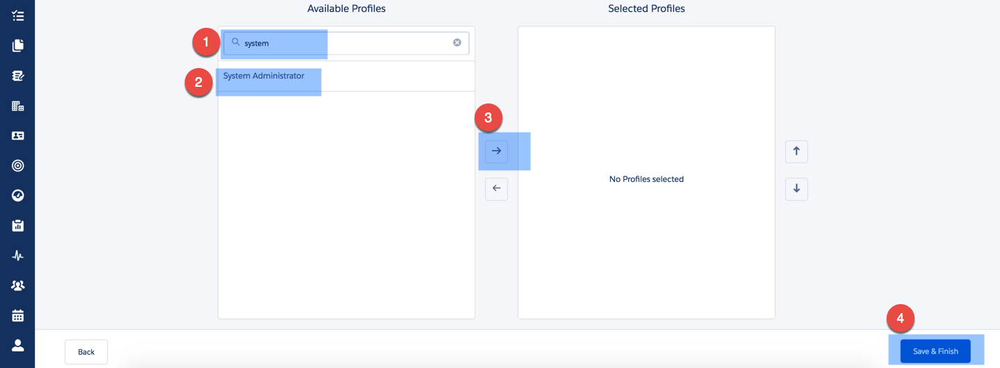

17. Come back to the previous tab, click *Refresh*, and add page to the navogation menu. Do the same for the Salesforce1 tab as well, and click *Save*.

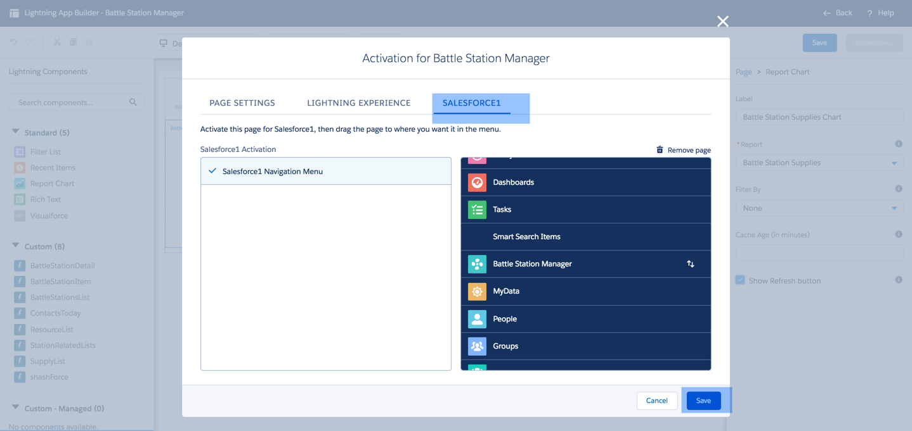

18. Click on the *Back* button to return to the Setup. Notice that the navigation menu on the left has changed. Click on the icon for the *Battle Station Manager*.
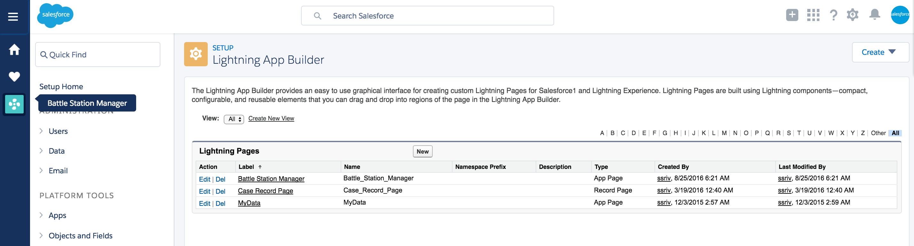
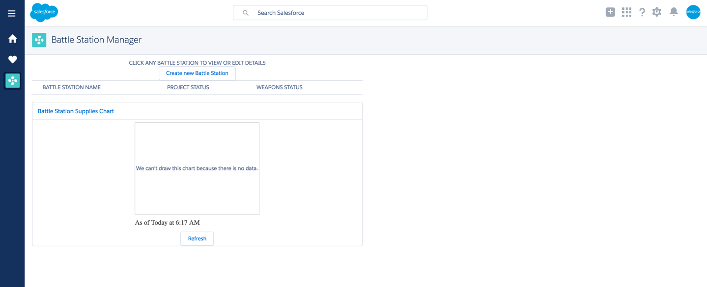


### <a name="step8"></a>Step 8: Add functionality with Lightning Events

#### What you'll do
You will create Lightning Events which will be fired and handled by the components to communicate and perform actions.

1. In the developer console, click *File > New > Lightning Event*, give it a name `StationClickEvent` and click Submit to see the newly created skeletal event markup.
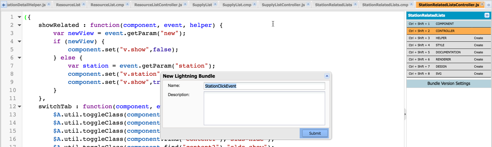
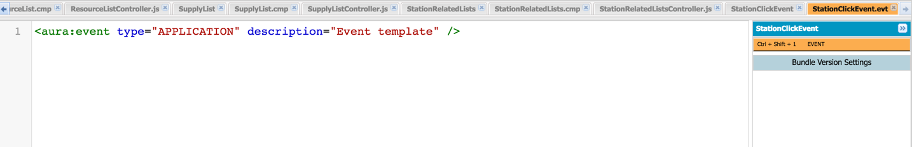

2. Clear the default markup code and replace with below code, and click *File > Save*:
	```html
	<aura:event type="APPLICATION" access="GLOBAL">
	    <aura:attribute name="station" type="Battle_Station__c" access="GLOBAL"/>
	    <aura:attribute name="new" type="Boolean" access="GLOBAL"/>
	</aura:event>
	```


3. In the developer console, click *File > New > Lightning Event*, give it a name `updatedListEvent` and click Submit to see the newly created skeletal event markup.

4. Leave the default markup as is, and click *File > Save*:
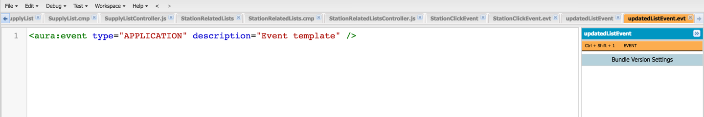

5. Open the *BattleStationsList* component markup, and add the following code after the first `aura:component` line:
	```html
	<aura:registerEvent name="showStation" type="c:StationClickEvent"/>
	<aura:handler event="c.updatedListEvent" action="{!c.loadStations}"/>
	```


6. Open the *BattleStationItem* component markup, and add the following code after the first `aura:component` line:
	```html
	<aura:registerEvent name="showStation" type="c:StationClickEvent"/>
	```
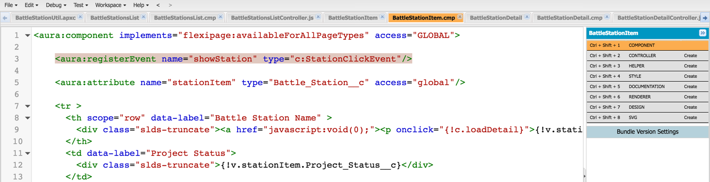

7. Open the *BattleStationDetail* component markup, and add the following code after the first `aura:component` line:
	```html
	<aura:handler event="c:StationClickEvent" action="{!c.showStation}"/>
	```


8. Open the *ResourceList* component markup, and add the following code after the first `aura:component` line:
	```html
	<aura:registerEvent name="showStation" type="c:StationClickEvent"/>
	```


9. Open the *SupplyList* component markup, and add the following code after the first `aura:component` line:
	```html
	<aura:registerEvent name="showStation" type="c:StationClickEvent"/>
	```
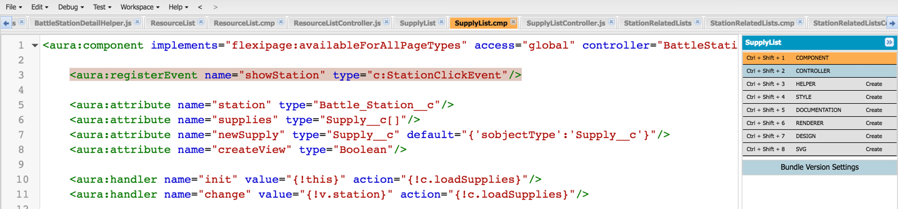

10. Open the *StationRelatedLists* component markup, and add the following code after the first `aura:component` line:
	```html
	<aura:handler event="c:StationClickEvent" action="{!c.showRelated}"/>
	```


### <a name="step9"></a>Step 9: Open the App and try it out!


#### What you'll do
You can play with the app now. Try creating, editing, deleting, or just accessing Battle Stations or Related Resources or Supplies.
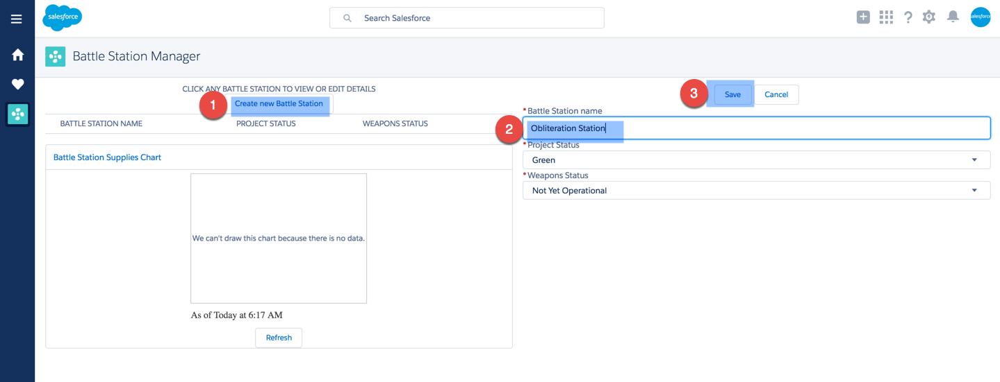
#### Final App after creating a few records
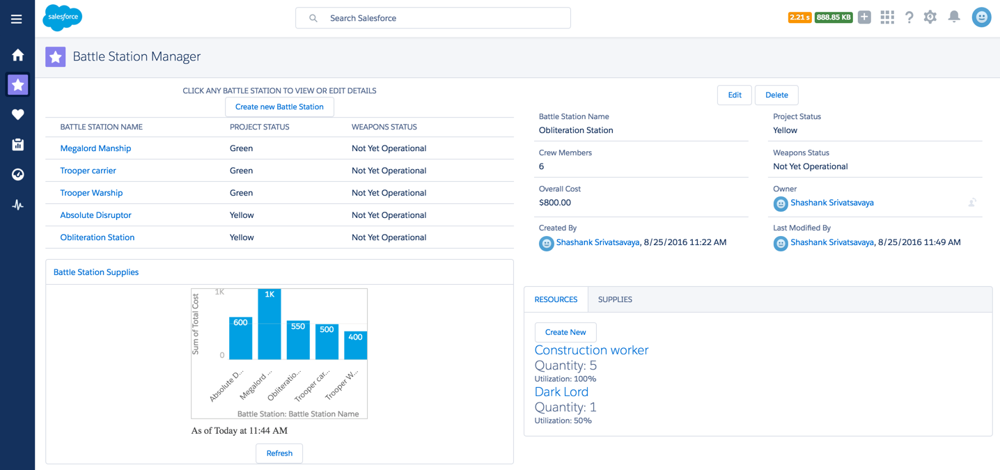


### Resources
##### TODO