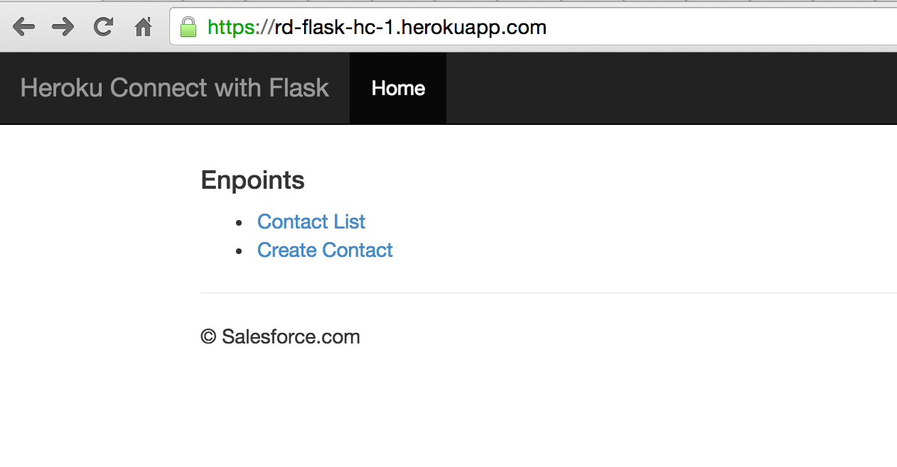
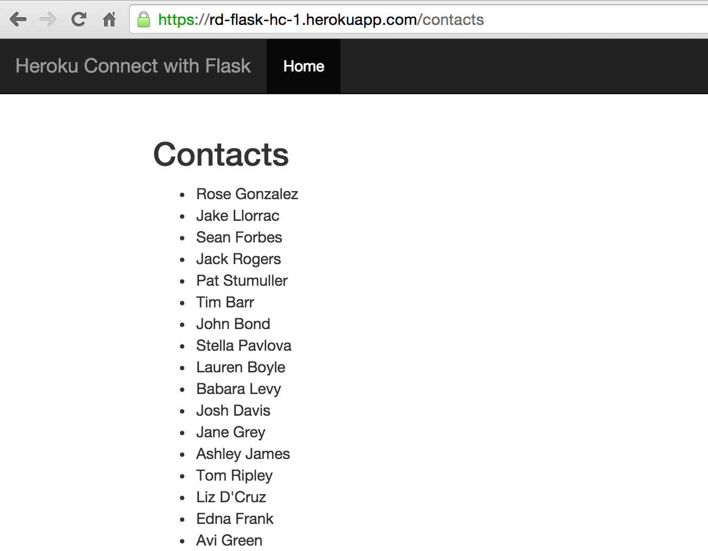
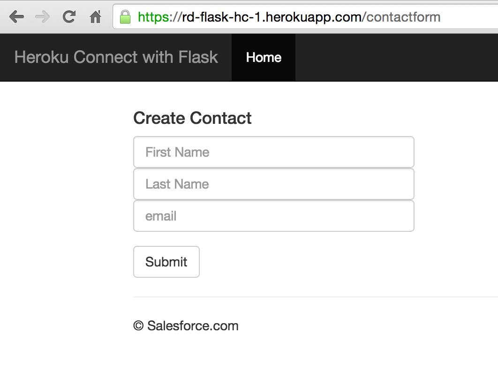

+++
date = "2016-07-29T16:18:23+05:30"
draft = true

title = "Heroku Connect : Sync Heroku app with Salesforce using Python Flask"

+++

1. [Introduction](#introduction)
2. [Prerequisites](#prerequisites)
3. [Clone the Source Code](#clone-the-source-code)
4. [Heroku Login](#heroku-login)
5. [Requirements File](#requirements-file)
6. [Procfile](#procfile)
7. [DB Initialization](#db-initialization)
9. [Flask Controller](#flask-controller)
  * [List Contacts](#list-contacts) 
  * [Create Contacts](#create-contacts)
10. [Deploying to Heroku](#deploying-to-heroku)
11. [Add PostgreSQL Add-On](#add-postgresql-add-on)
12. [Add Heroku Connect Add-On](#add-heroku-connect-add-on)
13. [Configure Heroku Connect Add-On](#configure-heroku-connect-add-on)
14. [Home Page](#home-page)
15. [Contact List](#contact-list)
16. [Create a New Contact](#create-a-new-contact)
17. [Optional Step Show Contacts Locally](#optional-step-show-contacts-locally) 
18. [Summary](#summary)
  
## Introduction

This workshop shows how to **Create** and **Run** a Python app with psycopg2 which uses PostgreSQL based Heroku Connect


Figure 1 show how the HerokuConnect Add-On interacts with Heroku Postgres and force.com behind the scenes.
Make sure you have [Python](https://www.python.org/downloads/) installed.  Also, install the [Heroku Toolbelt](https://toolbelt.heroku.com/)

We will be using a basic Flask app available at flask_psycopg2_v2

This app has four rest endpoints

    @app.route('/') which displays Hello world
    @app.route('/contacts') which fetches list of contacts from Postgres table salesforce.contact
    @app.route('/create_contact', methods=['POST','GET']) which creates a new contact
    @app.route('/contactform') which serves an HTML Form for entering new contact details

## Prerequisites

This workshop assumes you have following setup

* [Heroku Login](https://signup.heroku.com/)
* [Heroku CLI] (https://devcenter.heroku.com/articles/heroku-command-line#download-and-install)
* [git](https://git-scm.com/downloads)
* [Salesforce Developer Edition Account](http://developer.salesforce.com/signup)


## Clone the Source Code 

``` bash

$ git clone https://github.com/rajdeepd/flask-psycopg2-v2

```

## Heroku Login

First download CLI, install it and run the following command. 

``` bash

$ heroku login

```

## Requirements File

*Note : This section is for information only*

Notice that the Requirements file already exists, this will be used by Heroku to setup the dynos

```bash

    $ cat requirements.txt
    Flask==0.10.1
    gunicorn==19.3.0
    itsdangerous==0.24
    Jinja2==2.8
    MarkupSafe==0.23
    psycopg2==2.6.1
    Werkzeug==0.11
    wheel==0.24.0

```

## Procfile

*Note : This section is for information only*

There is already a Procfile which tells the Heroku what kind of Dyno is required and the source for the application.

``` bash

    web: gunicorn app:app --log-file -

```

## DB Initialization

*Note : This section is for information only*

We will parsing the DATABASE_URL environment variable to connect to PostgreSQL database. The PostgreSQL Python driver is already configured in the requirements file.

Steps are

1. Parse DATABASE_URL into variable `url`
2. Create a connection string `db` from the parsed `url`.
3. Create a Database connection `conn`.
4. Open a Database cursor `cur`.

``` python

url = urlparse.urlparse(os.environ.get('DATABASE_URL'))
db = "dbname=%s user=%s password=%s host=%s " % (url.path[1:], 
     url.username, url.password, url.hostname)
schema = "schema.sql"
conn = psycopg2.connect(db)
cur = conn.cursor()

```
## Flask Controller

*Note : This section is for information only*

`app.py` is the main controller for our applications and code listing below shows the implementation of various use cases

### List Contacts

``` python 
@app.route('/contacts')
def contacts():
    try:
        cur.execute("""SELECT name from salesforce.contact""")
        rows = cur.fetchall()
        response = ''
        my_list = []
        for row in rows:
            my_list.append(row[0])

        return render_template('template.html',  results=my_list)
    except Exception as e:
        print(e)
        return []
```

### Create Contacts

#### Implementation of `/createcontactform` endpoint

``` python

@app.route('/contactform')
def contactform():
   return render_template('contactform.html')

```


#### Implementation of `/create_contact` endpoint. 

``` python

@app.route('/create_contact', methods=['POST','GET'])
def create_contact():

    try:
        if request.method == "POST":
            first_name = request.form["first-name"]
            last_name = request.form["last-name"]
            email = request.form["email"]

            app.logger.info(first_name)
            statement = "insert into salesforce.contact(firstname, 
                        lastname, email) values ('" \
                + first_name + "','" + last_name + "','" + email + "');"
            cur.execute(statement)
            conn.commit()
            errors = []
            return render_template('result.html', errors=errors, 
                                   firstname=first_name,
                                   lastname=last_name)
    except Exception as e:
        print(e)
        return []
```

    
## Deploying to Heroku

Before moving on, create a [Heroku](https://signup.heroku.com/) account and run `$ heroku login` command to login to your created heroku account.

``` bash

$ heroku create
$ git push heroku master
$ heroku open
```
## Add PostgreSQL Add-On

Add Postgress Add-On as shown below.

  ``` bash
  $ heroku addons:create heroku-postgresql:hobby-dev
  ```
## Add Heroku Connect Add-On

Configure Heroku Connect Add-On. Command below configures Herok-Connect Add-On to the application.

  ``` bash
  $ heroku addons:create herokuconnect
  ```

## Configure Heroku Connect Add-On

* Setup Connection

    

* Enter Schema Name : This is the schema name underwhich database will be created.

    

* Trigger OAuth 

     

* Enter Salesforce.com developer account credentials

    

* Create Mappings

      

* Create Mappings Contacts : Choose the fields in Salesforce Schema which need to be mapped to Postgres Database in the application.

     

* **Write Enable** : Make sure you enable `Write to Salesforce any updates to your database` check box

* Explore Contacts in the Dashboard

    

## Home Page

    
  
## Contact List

  Browse to URL `http://{your-app-name}.herokuapp.com/contacts` to see the list of contact names.
   

## Create a New Contact
   
  Browse to URL `http://{your-app-name}.herokuapp.com/createcontactform` to see the list of contact names.

   

## Optional Step Show Contacts Locally 

### Prerequisites

* Python 2.7
* [pip](https://pip.pypa.io/en/stable/installing/) 
* [virtualenv](https://virtualenv.pypa.io/en/stable/)
* PostgreSQL client (Optional if you want to run the application locally)

1. Install Virtual Environment

    Go to the application Folder `flask-psycopg2-sample` and install a virtual environment in it.

    ``` bash
    $ cd flask-psycopg2-v2
    $ virtualenv venv
    $ source venv/bin/activate
    ```
2. Install Dependencies

     ``` bash
     $ pip install flask gunicorn psycopg2
     ```
 
3. Configure the DATABASE_URL in the local environment


     ``` bash
      $ heroku config

      === fast-sands-40695 Config Vars
      DATABASE_URL:      postgres://<user_name>:<password>@<ipaddress>.compute-1.amazonaws.com:5432/<database_name>
      HEROKUCONNECT_URL: DATABASE_URL:salesforce

     ```
4. Export DATABASE_URL

     ``` bash
    
     $ export DATABASE_URL=postgres://<user_name>:<password>@<ipaddress>.compute-1.amazonaws.com:5432/db
     ```

    Open the following URL `http://localhost:5000/contacts` you should be able see the contacts.


5. Run the app using the following command

     ``` bash
     $ python app.py
     ```

   Your app should now be running on [localhost:5000](http://localhost:5000)


## Summary

  In this workshop we learnt how to configure a Python Flask Application to work with Heroku Connect. We used Psycopg2 driver for talking to the PostgreSQL database deployed on Heroku.

## Appendix

[Execute using PyCharm](execute_using_pycharm)

  
  

