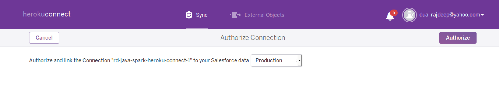
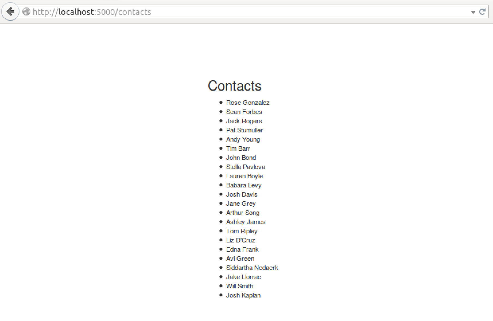
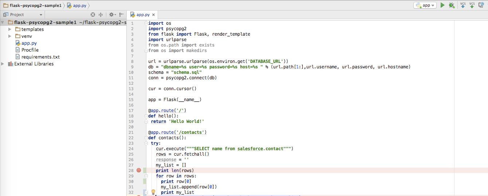
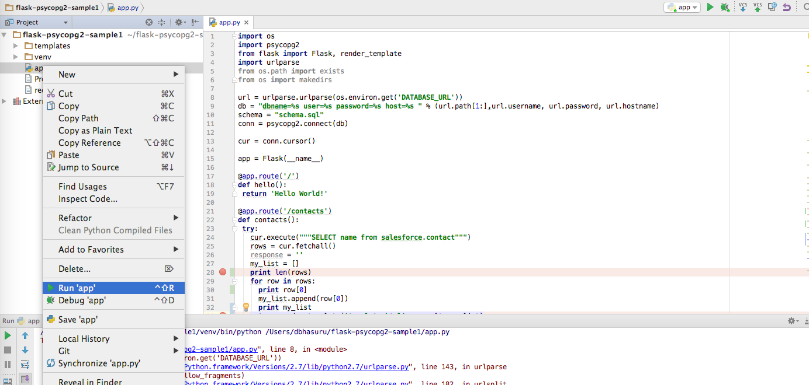

+++
date = "2016-07-29T16:18:23+05:30"
draft = true

title = "Heroku Connect : Sync Heroku app with Salesforce using Python Flask"

+++

1. [Introduction](#introduction)
2. [Install Virtual Environment](#install-virtual-environment)
3. [Creating a Simple Flask App](#creating-a-simple-flask-app)
4. [Initialize Git](#initialize-git)
5. [Create a Requirements File](#create-a-requirements-file)
6. [Create a Procfile](#create-a-procfile)
7. [Deploying to Heroku](#deploying-to-heroku)
8. [Add PostgreSQL Add-On](#add-postgresql-add-on)
9. [Add Heroku Connect Add-On](#add-heroku-connect-add-on)
10. [Configure Heroku Connect Add-On](#configure-heroku-connect-add-on)
11. [Add Code for contacts endpoint](#add-code-for-contacts-endpoint) 
12. [Add Jinja Template](#add-jinja-template)
13. [Update python packages](#update-python-packages)
14. [Add Requirements file](#add-requirements-file)
15. [Update Changes in Heroku](#update-changes-in-heroku)
16. [Show Contacts](#show-contacts)
17. [Show Contacts Locally](#show-contacts-locally)
18. [Executing using PYCHARM](#executing-using-pycharm)
17. [Summary](#summary)
  
# Introduction

This workshop shows how to **Create** and **Run** a Python app with psycopg2 which uses PostgreSQL based Heroku Connect


Figure 1 show the  how HerokuConnect Add-On interacts with Heroku Postgres and force.com behind the scenes
Make sure you have Python installed.  Also, install the [Heroku Toolbelt](https://toolbelt.heroku.com/)

## Install Virtual Environment

Create a folder `flask-psycopg2-sample` and install a virtualenvironment in it.

  ``` bash

    $ mkdir flask-psycopg2-sample
    $ cd flask-psycopg2-sample
    $ virtualenv venv
    $ source venv/bin/activate

  ```

Install Dependencies

  ``` bash

  $ pip install flask gunicorn

  ```
  
## Creating a Simple Flask App

1. First Create a base Flask app with simple REST endpoint/ in a file `app.py` in the folder created above.
  
    ``` python
      
    from flask import Flask
    app = Flask(__name__)

    @app.route('/')
    def hello_world():
      return 'Hello World!'

    if __name__ == '__main__':
      app.run()
      
    ```

2. Run the app using the following command

    ``` bash
    $ python app.py
    ```

 Your app should now be running on [localhost:5000](http://localhost:5000)

## Initialize Git

Initialize the git repository as shown by commands below.

  ``` bash
  $ git init
  $ git add .
  $ git commit -m "initial commit"

  ```
## Create a Requirements File

  ``` bash
  $ pip freeze > requirements.txt
  ```
   
## Create a Procfile

Create a file name `Procfile` in the root of the app and add following content. This specifies that the app uses a `web` dyno with `gunicorn` as http server.

  ``` bash
  web: gunicorn app:app --log-file -
  ```
    
## Deploying to Heroku

  ``` bash
    $ heroku create
    $ git push heroku master
    $ heroku open
  ```
## Add PostgreSQL Add-On

Add Postgress Add-On as shown below

  ``` bash
  $ heroku addons:create heroku-postgresql:hobby-dev
  ```
## Add Heroku Connect Add-On

Configure Heroku Connect Add-On. Command below configures Herok-Connect Add-On to the application.

  ``` bash
  $ heroku addons:create herokuconnect
  ```

## Configure Heroku Connect Add-On

* Setup Connection

    

* Enter Schema Name : This is the schema name underwhich database will be created.

    

* Trigger OAuth 

     

* Enter Salesforce.com developer account credentials

    

* Create Mappings

      

* Create Mappings Contacts : Choose the fields in Salesforce Schema which need to be mapped to Postgres Database in the application.

     

* Explore Contacts in the Dashboard

    

## Add Code for contacts endpoint 

  First Add following lines which configure Connection object conn to PostgreSQL Database.
  
  ```python
    url = urlparse.urlparse(os.environ.get('DATABASE_URL'))
    db = "dbname=%s user=%s password=%s host=%s " % (url.path[1:], 
          url.username, url.password, url.hostname)
    schema = "schema.sql"
    conn = psycopg2.connect(db)
    cur = conn.cursor()
  ```
  
  Add code for the Getting the Contacts.
  
  ``` python

    @app.route('/contacts')
    def contacts():
        try:
          cur.execute("""SELECT name from salesforce.contact""")
          rows = cur.fetchall()
          response = ''
          my_list = []
          for row in rows:
              my_list.append(row[0])
          return render_template('template.html',  results=my_list)
        except Exception as e:
          print e
          return []

  ```
Complete Code listing

  ``` python

    import os
    import psycopg2
    from flask import Flask, render_template
    import urlparse
    from os.path import exists
    from os import makedirs
    
    url = urlparse.urlparse(os.environ.get('DATABASE_URL'))
    db = "dbname=%s user=%s password=%s host=%s " % (url.path[1:], 
                       url.username, url.password, url.hostname)
    schema = "schema.sql"
    conn = psycopg2.connect(db)
    
    cur = conn.cursor()
    
    app = Flask(__name__)
    
    @app.route('/')
    def hello():
        return 'Hello World!'
    
    @app.route('/contacts')
    def contacts():
      try:
        cur.execute("""SELECT name from salesforce.contact""")
        rows = cur.fetchall()
        response = ''
        my_list = []
        for row in rows:
          my_list.append(row[0])
        return render_template('template.html',  results=my_list)
      except Exception as e:
        print e
        return []
    if __name__ == '__main__':
      app.run()

  ```
  
## Add Jinja Template 

  The code shown in previous section uses template.html file which is a Jinja template. Add this file under folder templates
  
  ``` html

    <html>
      <head>
        <title>Flask Template Example</title>
        <meta name="viewport" content="width=device-width, initial-scale=1.0">
        <link href="http://netdna.bootstrapcdn.com/bootstrap/3.0.0/css/bootstrap.min.css" 
                    rel="stylesheet" media="screen">
        <style type="text/css">
          .container {
            max-width: 500px;
            padding-top: 100px;
            }
        </style>
      </head>
      <body>
        <div class="container">
          <p>Contacts:</p>
          <ul>
            
            <li>{{r}}</li>
            
          </ul>
        </div>
        <script src="http://code.jquery.com/jquery-1.10.2.min.js"></script>
        <script src="http://netdna.bootstrapcdn.com/bootstrap/3.0.0/js/bootstrap.min.js">
        </script>
      </body>
    </html>
  ```

## Update python packages
  
  ``` bash
     $ pip install psycopg2
  ```
  
## Add Requirements file

  ``` bash
     $ pip freeze > requirements.txt
  ```

## Update Changes in Heroku

  ``` bash
    $ git add .
    $ git commit -m "Added code for contacts"
    $ git push heroku master
  ```
  
  Open the App again in Heroku
  
  ``` bash
    $ heroku open
  ```
  
## Show Contacts

  Browse to URL `http://{your-app-name}.herokuapp.com/contacts` to see the list of contact names.
   
  
## Show Contacts Locally

  Configure the DATABASE_URL in the local environment

  ``` bash
    $ heroku config

    === fast-sands-40695 Config Vars
    DATABASE_URL:      postgres://<user_name>:<password>@<ipaddress>.compute-1.amazonaws.com:5432/<database_name>
    HEROKUCONNECT_URL: DATABASE_URL:salesforce
  ```

  Export DATABASE_URL

  ``` bash
    $ export DATABASE_URL=postgres://<user_name>:<password>@<ipaddress>.compute-1.amazonaws.com:5432/<database_name>
  ```

  Open the following URL :code:`http://localhost:5000/contacts` you should be able see the contacts.

## Executing using PYCHARM

  Install the [Pycharm](https://www.jetbrains.com/pycharm/download/). And add your directory as a project to PyCharm.

  

  Click on `app.py` and run the app.

  

  Open the following URL :code:`http://localhost:5000/contacts` you should be able see the contacts.

## Summary

  In this workshop we learnt how to configure a Python Flask Application to work with Heroku Connect. We used Psycopg2 driver for talking to the PostgreSQL database deployed on Heroku.

  

  
  

