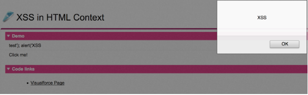

+++
date = "2016-07-29T16:18:23+05:30"
draft = true
title = "Secure Apps - Understand Cross Site Scripting "

+++

## Introduction

Salesforce is constantly striving to make our platform as secure as possible. As a result Force.com has many built in security functions to protect end users: some enabeld by default while others require the developers to enable them within their code. While we aim to bake-in as much security constraints as possible because of the flexibility and extensibility of the platform it is completely possible for developers to write insecure code. 

Of all the issues we commonly see developer introduce into their apps, Cross-Site Scripting (XSS) is one of the most widely seen web application vulnerabilities. As a result we’ve chosen this vulnerability to be the focus of our workshop. Our goal is that by the end of this class you should be able to explain XSS, know how to identify it in your code and remediate the issues. To support that we will have numerous demos, where you’ll get to “be the attacker” spotting and exploiting vulnerabilities as well as “being the defender” remediating them.

## Learning Application Security with a Developer Edition Org

Don’t worry in this workshop—we’re not going to teach you how to write vulnerable Force.com code. Instead, we’ve created a special org that has vulnerable applications already deployed for you to practice in. Your job will be to identify the vulnerabilities and to fix them!

To get set up in the Kingdom Management developer org, you’ll need to sign up:  

1. Go to the custom sign-up page for the Kingdom Management developer org: 
    https://security.secure.force.com/SecDev_Trailhead_Signup
2. Fill out the form using an active email address and click Sign Me Up.

  

3. Check your email for an activation request. 

  

4. Click the link in the email, and complete your registration by setting a new password and challenge question.
    You should now be logged into the Kingdom Management developer org that we’ll be using for this class. This is an org that we’ve expanded from our Trailhead class so after you’ve completed this workshop you can use this same org to continue on your secure coding training! For this workshop we’ve expanding the existing trailhead demos to add a few new ones that we’ll use today. So let’s enable those now.
5. Click on the Setup link
6. Click Manage Users -> Profiles -> System Administrator
7. Click the Edit button
8. Click the checkbox next to DF16 Workshop to make our custom app visible
9. Click the Save button
10. Select the DF16 Workshop from the app selector in the top right corner

  

If you see something similar to the above screen you are now ready to start learning how to defend your users against XSS attacks by using application security!

**Note**: The code in the Kingdom Management developer org is vulnerable to certain kinds of vulnerabilities. In the developer org these vulnerabilities are benign, but they may pose more serious problems if replicated to a production Salesforce environment. Use the Kingdom Management application for educational purposes only.

## What is Cross-Site Scripting?

Cross-Site Scripting (XSS) is an injection vulnerability that occurs when an attacker can insert unauthorized JavaScript, VBScript, HTML, or other active content into a web page. When other users view the page, the malicious code executes and effects or attacks the user. For example, a malicious script can hijack the user’s session, submit unauthorized transactions as the user, steal confidential information, or simply deface the page.

## How Does an XSS Attack Work?

In the simplest form, XSS attacks occur **when user-supplied input is reflected in the HTML of a web page**. Due to poor separation between code context and user data, the user input is executed as code. 
In the Kingdom Management app, there is a page to create a scroll that can be used in the Kingdom to post announcements. Let’s test it out for XSS vulnerabilities!

**Note**: For each of the demos in this class please **Firefox** as your web browser

1. In your Kingdom Management developer org select the **XSS Basics - Demo** tab.
2. In the message text field, enter a basic message like: “Hear ye, hear ye, come one, come all!” and click the **Create Scroll** button.
3. The page should refresh, and you should see the text you entered in the previous step.
4. Right click on the page and select **View source**.
5. If you search in the raw HTML for your message, you should see HTML like: <i>Hear ye, hear ye, come one, come all!</i>
  But what if you tried something different? XSS vulnerabilities result when user input is executed as code. So what happens if we enter code into this message box? Will it execute?
6. Back in the Kingdom Management developer org, enter the following before clicking **Create Scroll**: <u> Testing for boldness </u>
  Did the underline effect occur? Yes! It appears that text we enter into the input box is being interpreted as code! Now what happens if we try something a lot more complicated?
7. Enter the following in the message text field: ``` </img>```
8. Click Create Scroll. You will see a little window pop up.

  

## Try Another Cross-Site Scripting Attack

1. In your Kingdom Management developer org, navigate to the XSS Basics Challenge tab in the Cross-site Scripting (XSS) application. You will see an input field and a button.
2. Using the input field, enter a cross-site scripting payload that meets the following requirements:
  * Includes HTML text in the following form:  `<a>any text</a>`
  * Uses the onmouseover property of the html `<a>` tag to initiate a JavaScript alert
  * Will show the XSS payload when a mouse is hovered over the text 
3. Click **Attempt XSS!** and hover over the resulting text to confirm your payload was successful.

## Force.com XSS Protections

As a platform, Salesforce offers its customers and developers maximum flexibility for accessing and storing data. We don’t control what you place on our platform, but wherever possible we make sure it’s displayed securely. So the Salesforce approach to XSS defense is to perform output encoding. In fact, by default all merge fields are automatically HTML encoded! We’ll discuss gaps that you’ll need to be aware of and account for in your applications.

## Automatic HTML Encoding

As we mentioned previously, Salesforce automatically HTML encodes any values and merge fields placed in HTML context. This includes all standard functionality, as well as Visualforce pages and components.  

Let’s see this in action in our Kingdom management org.

1. Click on the Automatic HTML Encoding Demo tab
  On this tab we have a simple app which has a greeting message to the user

  

  You may notice that to construct this greeting the app utilizes the URL parameter name as a input.
2. Try changing value of the name parameter to something different like THIS IS A TEST and the message should change
  Let’s see if this is vulnerable to XSS by using an attack payload similar to one that we’ve used before
3. Change the name parameter to ` `
  Wait...the alert message didn’t pop up. Why?
4. Right click on page and select **View Page Source**
5. Search in the source code (using CTRL+F) for THIS IS AN XSS ATTACK
  You should notice that the platform automatically encoded all the values that we entered into their HTML entity equivalents:

  ` Hello &lt;img src="test" onerror="alert(&#8216;THIS IS AN XSS ATTACK&#8217;)"/&gt;!`

  This is the automatic HTML encoding in action and as a result it treats the data we entered as text, not code, neutralizing the XSS attack!

## Disabling Automatic HTML Encoding

While it’s great that Salesforce provides this functionality for developers out of the box, there are certain use cases where you may want to have raw HTML embedded in the page. To support this, several Visualforce tags have an optional attribute called “escape” which will allow developers to disable the automatic encoding.

Let’s see what happens when this attribute is set to false in our demo org.

1. Click on the **XSS Disabling HTML Encoding Demo** tab
  You’ll see the same app as before. It’s a simple app designed to take in the value of the url parameter name and inserts it into a greeting message. However this time the visualforce page is applying some extra styling to the merge field.
2. Click on the visualforce link at the bottom to see the code
  ` <apex:outputlabel value="Hello <b>{!name}</b>!" escape="false"/>`
  
  The platform encoding is explicitly disabled by the addition fo the escape = “false” attribute.
3. Navigate back to **XSS Disable HTML Encoding** tab 
4. Set the name parameter to one of our XSS attack payloads: ` `

  

  The attack works! 

  While disabling encoding may be necessary for certain use cases, you should exercise **extreme caution**. If you disable automatic encoding, you have to rely on other XSS prevention techniques (like whitelisting) to ensure that your code isn’t vulnerable to XSS.
  
## Salesforce Default Protections in Different Execution Contexts

As we’ve seen from our above demos the platform automatically HTML encodes merge fields (assuming you have not explicitly disabled it) protecting you from XSS attacks. However this protection is specific to fields utilized HTML context. What about other contexts like script and style? Let’s find out! 

### HTML Context

The first context that we’ll look at is HTML context. Remember that unless explicitly disabled Salesforce will automatically HTML encode any merge fields included in HTML context. 

Let’s dive into some examples in your developer org

1. Click on the **XSS in HTML Context** Tab
2. Click on the Visualforce Page link at the bottom to view the source code
3. Search for ` {!$CurrentPage.parameters.userInput}` in the code and you should see two instances of this variable being used
 
   ``` html
   <apex:outputtext>
   {!$CurrentPage.parameters.userInput} 
   </apex:outputtext>
   <div onclick=”console.log(‘{!$CurrentPage.parameters.userInput}’)”>Click me!</div>
  ```
  
  The first as we’ve discussed extensively is safe, the platform automatically encodes all merge fields included in HTML context. But what about the second?
4. Navigate back to the **XSS in HTML Context** tab
5. Change the URL parameter **userInput** to the following value test'); alert('XSS
6. Click on **Click me!**

  

  Why did this work? If you look again at the code from Step 3 userInput is rendered with a JavaScript execution context embedded with an HTML context. Therefore **The auto-HTML encoding alone is insufficient**. So it’s important to remember if your application passes through multiple parsing contexts, the default protection isn’t **fully sufficient**.

### Script Context

When inserting merge fields into JavaScript, watch out for XSS vulnerabilities. Lets take a look at an example in our org.

1. Click on the **XSS in Script Context** tab
2. Click on the Visualforce link at the bottom to view the code
 
  ``` html 
   <script>
   var a = '{!$CurrentPage.parameters.userInput}';
   </script>
   <apex:outputtext>The value of the userInput parameter is: {!$CurrentPage.parameters.userInput}</apex:outputtext> 
  ```
  We’ve got a user controllable variable userInput being included directly in script context. Is this vulnerable? Let’s find out.
3. Navigate back to the **XSS in Script Context** tab
4. Try typing in the following string for the userInput URL parameter ` ‘;alert(‘XSS’);//` 
 
  

  Yes it is vulnerable! So keep in mind that any user input is inserted into script context isn’t automatically encoded and is vulnerable to XSS.

### Style Context

CSS (cascading style sheets) is an increasingly complex language that is slowly becoming standardized across browsers. Modern browsers don’t allow JavaScript injection within CSS attribute values. However, some older browsers do. As a result, be careful about utilizing merge fields within a style context.

Let see what a vulnerable app would look like in your developer org!

1. Click on the **XSS in Style Context** tab
2. Click on the Visualforce Page link at the bottom of the screen to view the source code

  You’ll notice in this simple app the developer is using the variable “color” in order to add additional style to the paragraph attribute.
3. Navigate back to the XSS in Style Context tab and try entering different values for the URL parameter color like red

  The background color of the page should change! User controllable input that’s being used directly in the visualforce page, is this vulnerable to XSS attacks?
4. Try entering the following for the color parameter ``` blue</style>```

  You should see something like this:

  
  
  So as you can see, the default automatic HTML encoding doesn’t apply and the application is vulnerable to XSS.

## Identify potential cross-site scripting vectors.

1. In your Kingdom Management developer org, navigate to the Built-In XSS Protections Challenge tab within the Cross-site Scripting (XSS) application. You will see text output corresponding to merge fields in the Visualforce code.
2. Use the link on the bottom of the page to edit the Visualforce page Built_In_XSS_Protections_Challenge, or access the code through the developer console or your favorite IDE.
3. Locate any usage of the merge field “{!sampleMergeField}”. Edit the code comment beneath the merge field to indicate whether or not this code block is vulnerable to cross-site scripting. 
  * If the code is vulnerable, the comment should appear as <!-- Line 10 is vulnerable to XSS: YES →
  * If the code is not vulnerable, the comment should appear as <!-- Line 10 is vulnerable to XSS: NO-->
  
# Prevent XSS in Force.com Applications

## Platform Provided Encoding Functions 

While the automatic HTML encoding provided by the platform is a fantastic default protection for a majority of use cases, it’s not a complete solution. Luckily Salesforce provides encoding functions in both Visualforce and Apex. In this unit, we’ll cover each of these along with example code that you can walk through to learn how to remediate XSS vulnerabilities.

## Platform Encoding in Visualforce

In Visualforce, the platform has three main encoding functions that developers can use to neutralize potential XSS threats: HTMLENCODE, JSENCODE, and JSINHTMLENCODE. To choose which encoding to use, consider how your browser is parsing the output.

  * If the value is going to parsed by the JavaScript parser, use JSENCODE().
  * If the value is going to parsed by the HTML parser, use HTMLENCODE().
  * If it’s a combination of both …

We’ll give examples to illustrate where and when to apply each encoding function.

## JSENCODE()

**JSENCODE()** is a function that developers can use to perform JavaScript encoding of input prior to reflection in JavaScript context. This function encodes text and merge field values for use in JavaScript by inserting escape characters, such as a backslash (\), before unsafe JavaScript characters, such as the apostrophe ('). The function is used in cases where a merge field is directly used as a JavaScript variable.

## JSENCODE() in Action!

Now let’s learn how to fix a JavaScript-based XSS vulnerabilities using JSENCODE.

1. Click the **XSS Visualforce Mitigations Demo** tab.
2. Click the **JavaScript-based XSS** button to demo the vulnerability.

  You should see an image-based XSS injected into the page, defacing it. 
3. Click the Visualforce and Apex links at the bottom of the page to find the vulnerable code.
  
  **Apex**:

  ``` java 
  public pageReference JSXSS(){
      title = 'THEME VIOLATION!!!!\';var newHTML = document.createElement(\'div\');newHTML.innerHTML = \'\';document.body.appendChild (newHTML);var x =\'x';
      return null;
    }
  ```
  
  **Visualforce**:
  
  ``` html
  <script>
      var vip = '{!title}';
      [...]
  </script>
      [...]
  <apex:commandButton value="Click here to view the JavaScript-based XSS!" action="{!JSXSS}"/>
  ```
  You’ll notice that when the button is clicked on line 36 it called the JSXSS function in Apex. This function sets the title to a XSS payload which is then rendered in Visualforce on line 14. 

  We’ll need to put some encoding around the output in line 14 to prevent this attack!

4. Edit the Visualforce page by changing line 14 to Var vip = ‘{!JSENCODE(title)}’;.
5. Click Save and navigate to the XSS Visualforce Mitigations Demo.
6. Click the JavaScript-based XSS button again.

If no image appears on the screen, then you’ve successfully mitigated XSS!

## HTMLENCODE()

**HTMLENCODE()** is a function that developers can use to perform additional HTML encoding of input prior to reflection in HTML context. For most use cases, developers don’t need to use this function, but it is required when the default platform encoding is turned off or when you’re adding user-controllable input directly to the DOM.

## HTMLENCODE() in Action

In the Kingdom Management app, you’ve started developing a profile page. Your eventual goal is to include a “friend finder” feature. Because users have control over the values in their profiles, you need to make sure you protect against XSS. Let’s go through it.

1. Log in to the Kingdom Management developer org and select the **Cross-Site Scripting (XSS)** app.
2. Click the **XSS Visualforce Mitigations Demo** tab.
  On the Visualforce page you see the various parts of the user profile, as well as buttons for testing cross-site scripting. These should save some time while testing your defenses! 
3. Click the first button labeled **Click here to view HTML-based XSS**.
  An XSS in the form of a embedded image appears on the page. This code is injected via the user parameter in the URL:
  
  https://c.na35.visual.force.com/apex/xss_visualforce_mitigations_demo?user=THEME+VIOLATION%21%21%21%21+%3Cimg+src%3D%22https%3A%2F%2Fdeveloper.salesforce.com%2Fresource%2Fimages%2Fastro.png%22%2F%3E
4. Use the link at the bottom of the page to view the Visualforce code and you see the following.
  
  ``` html
  <apex:outputText value="Welcome, <b>{!$CurrentPage.Parameters.user}</b>!" escape="false"/>
  ```
  Because of the escape=”false” setting, user-controlled content is rendered directly on the page. 
5. Edit the code, and add your defensive encoding as follows.
  
  ``` html
  <apex:outputText value="Welcome, <b>{!HTMLENCODE($CurrentPage.Parameters.user)}</b>!" escape="false"/> 
  ```
6. Click Save and navigate to the XSS Visualforce Mitigations Demo tab.
7. Click the HTML-based XSS button again.

The name looks strange, but there’s no theme violation. You prevented the XSS!

## JSINHTMLENCODE()

**JSINHTMLENCODE** is a legacy Visualforce function that was introduced when the platform didn’t always automatically HTML encode merge-fields. JSINHTMLENCODE is effectively a combination of HTMLENCODE(JSENCODE()), so before the introduction of auto-HTML encoding, developers called this function when including merge-fields in JavaScript event handlers within HTML (that is, onerror, onload). Now that the platform auto-HTML encodes, it’s sufficient to just call JSENCODE().

## JSINHTMLENCODE in Action!

Let’s try out the JSINHTMLENCODE function.

1. In your Kingdom Management developer org, click the **XSS Visualforce Mitigations Demo** tab.
2. Click the **JavaScript + HTML-based XSS** button to demo the vulnerability.
  You should see an image defacing the page.
3. To find the vulnerable code, click the Visualforce and Apex links at the bottom of the page.

  **Visualforce**:
  
  ``` html
  <script>
    [...]
  var html = '<br/><br/><b>---------------------</b>';
        html += '<br/>Personnel Name: {!JSENCODE(name)}';
        html += '<br/>Favorite color: {!JSENCODE(color)}';
        html += '<br/>Favorite animal: {!JSENCODE(animal)}';
        html += '<br/><b>---------------------</b>';
        document.getElementById('{!$Component.output2}').innerHTML = html;
  </script>
  [...]
  <apex:commandButton value="Click here to view the JavaScript + HTML-based XSS!" action="{!JSINHTMLXSS}"/>
  ```
  **Apex**:
  
  ``` java
  public pageReference JSINHTMLXSS(){
    color = 'THEME VIOLATION!!!! ';
        return null;
  }
  ```
  When the user clicks the commandButton the application called the JSINHTMLXSS function in Apex. This function sets a XSS payload to the color variable that is then processed by Visualforce.

  However, this time we’re wrapping the color variable in JSENCODE back in the visualforce page before rendering it to the user. So why is this still a vulnerability? 

  JSENCODE is an encoder specific to JavaScript context, so it prevents any JavaScript-based XSS such as “blue’;alert(‘hi’);//”. However, in this application our color variable is not just used in JavaScript context; it’s also written directly to the DOM via the innerHTML call, rendering the data as HTML. Therefore, in order to fully protect this application against XSS, both forms of encoding are required: JavaScript and HTML. Luckily, there is a combo encoding method provided by the platform: JSINHTMLENCODE().
4. Modify the Apex to use JSINHTMLENCODE() rather than JSENCODE().
5. Click Save.
6. Navigate to the XSS Visualforce Mitigations Demo tab.
7. Click the JavaScript + HTML-based XSS button again, and this time the embedded image shouldn’t appear.

  The important lesson to take away is that there is a form of encoding for every context, and you have to be aware of the context in order to encode properly. Using the wrong encoding method can be dangerous! 

## Platform Encoding in Apex

Up until now we’ve focused completely on preventing XSS by modifying your Visualforce pages. But what if you need to encode in Apex? 
In all honesty, encoding within the controller is strongly discouraged, but nevertheless, you may need to encode within the controller. For example, if you are generating dynamic HTML from within your controller. To do so, anything under the control of a user requires encoding to prevent special characters from being interpreted as code instead of text. Salesforce provides various Apex encoding functions through the Force.com ESAPI, which exports global static methods that you can use in your package to perform security encoding. This package can be installed in any Salesforce org as an unmanaged package. 

## The Force.com ESAPI in Action!

We installed the Force.com ESAPI package in the Kingdom Management developer org, so let’s see how you can use it instead of Visualforce encoding to prevent XSS!

1. Log in to the Kingdom Management Developer org and select the Cross-Site Scripting (XSS) app.
2. Click the **XSS Apex Mitigations Demo** tab.
3. On the Visualforce page, you see some profile functionality and an XSS button. If you inspect the Visualforce code, you see all the merge fields rendered with escape=”false”.
 
  ```
  Title: <apex:outputText value="{!title}" escape="false" /><br/>
  Name: <apex:outputText value="{!name}" escape="false" /><br/>
  Favorite Color: <apex:outputText value="{!color}" escape="false" /><br/>
  Favorite Animal: <apex:outputText value="{!animal}" escape="false" /><br/>
  ```
  You may remember from our discussion earlier that setting the escape attribute to false disables the built in HTML encoding provided by the platform. 
4. View the apex controller by clicking the link at the bottom of the page to see why the developers have done this.
  Everything is wrapped in the ` <b>` tag! To maintain the designed effect, the encoding will need to occur in Apex, focused specifically on the user controlled values.
5. Edit the controller and for each item that is sent to the page inside HTML content, wrap it in the ESAPI.encoder().SFDC_HTMLENCODE() method, as in this example.
  
  `title = '<b>' + ESAPI.encoder().SFDC_HTMLENCODE(person.Title__c) +'</b>';`
6. Click **Save** and return to the **XSS Apex Mitigations Demo** tab
7. Click the **View the HTML-based XSS!** button again

You should see that the encoding functions neutralized that attack payloads but kept the rest of the data bolded as desired. All functionality is maintained even with the addition of security!

## Final Challenge

**Title**: Fix potential cross-site scripting vectors.

**Description**: To complete this challenge, implement the correct cross-site scripting mitigation for each situation presented in the code. Some situations don’t require any mitigation at all. 

**Requirements**:

1. In your Kingdom Management developer org, navigate to the XSS Mitigations Challenge tab within the Cross-site Scripting (XSS) application. You will see text output corresponding to merge fields in the Visualforce code.
2. Use the link on the bottom of the page to edit the Visualforce page XSS_Mitigations_Challenge, or access the code through the developer console or your favorite IDE.
3. Locate any usage of the merge field “{!sampleMergeField}”. Review each instance of this merge field and wrap it in one of the following methods (if needed): HTMLENCODE(), JSENCODE, JSINHTMLENCODE. If the merge field doesn’t need any encoding, don’t make any changes to it.


