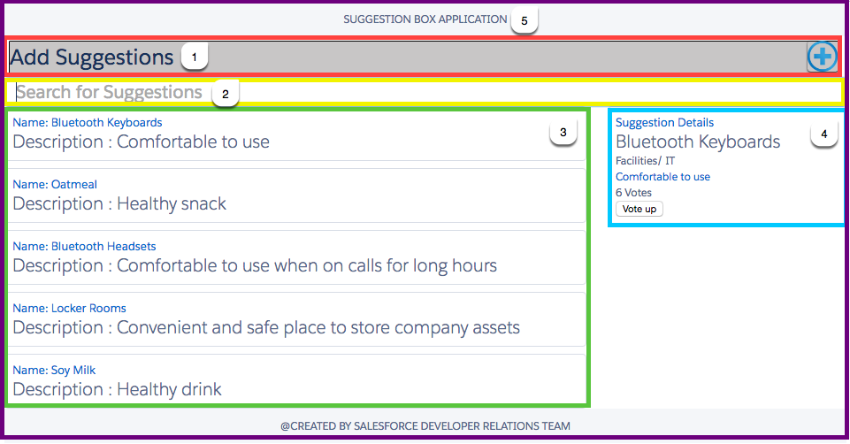
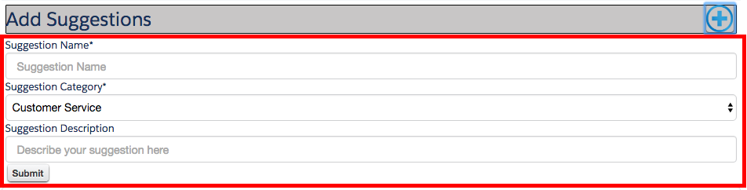
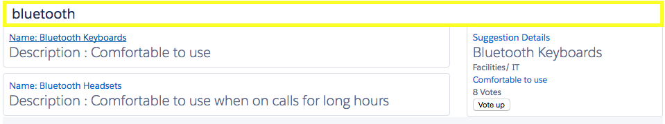
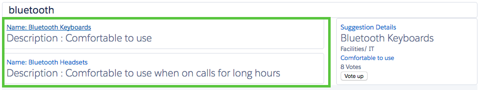

+++
date = "2016-07-29T16:18:23+05:30"
draft = true
title = "Build a Suggestion Box App with Lightning Experience"

+++


1. [Introduction](#introduction)
2. [Add a Custom Domain to Your Org with My Domain](#add_a_custom_domain_to_your_org_with_my_domain)
3. [Create a Server-side Apex Controller Class](#create-a-server-side-apex-controller-class)
4. [Create the SuggestionBoxCreate Component](#create-the-suggestionboxcreate-component)
5. [Create the SKChange Event and SearchBar Component](#create-the-skchange-event-and-searchbar-component)
6. [Create the SuggestionList Component](#create-the-suggestionlist-component)
7. [Create the SuggestionDetails Component](#create-the-suggestiondetails-component)
8. [Create the SuggestionBox Component](#create-the-suggestionbox-component)
9. [Create the SuggestionBoxApp Application](#create-the-suggestionboxapp-application)
10. [Summary](#summary)

## Introduction
In this project, you learn how to build a Lightning Application on App Cloud from start to finish.If you're new to App Cloud, the goal is to introduce you to the basics of app building together with introduction to the new lightning platform and basics to develop application using lightning components.If you're familiar with the App Cloud Admin features—managing users and security, customizing standard objects, and so on—the goal is to apply those skills to developing new application and learn how to extend the functionality of these applications using lightning. You need a Developer Edition org to complete this project. If you don't have one, you can sign up [here](https://developer.salesforce.com/signup).

You will build a Suggestion Box Lightning Application that allows employees to submit suggestions, search for existing suggestions and vote for them.All of this with the following steps:

* Install the pre-created building blocks of the Suggestion Box App by clicking [here](http://bit.ly/df16_sb_package)
  This package includes the app definition, data model, validation rules, process and reports and dashboard which together form the basic Suggestion box Application.You can install this app for Admins only for now.Go [here](https://help.salesforce.com/apex/HTViewHelpDoc?id=distribution_installing_packages.htm) for detailed steps to install an unmanaged package.
* Extend this application using Lightning components to design a stand-alone Suggestion Box Application which will look something like this:
 


Each rectangle in this image represents a lightning component:
* Red box: Displays the "add suggestion" functionality
* Yellow box: Displays the "search suggestion" functionality
* Green box: Displays the "results" of the search functionality
* Blue box: Displays the "details of the selected record" in the search functionality
* Purple box: "encampasses all the above functionalities into a single component" which then sits inside a Lightning Application

Let's begin with exploring our prebuilt Suggestion Box App which was installed using the package.

All eyes on the screen!

Now, that we know and understand how we can build a basic application using point-and-click, let us now extend this app using lightning components.The UI of the Application we will create will resemble the Lightning Experience UI as we will make use of Salesforce Lightning Design System.

The Lightning Component framework is a UI framework for developing dynamic web apps for mobile and desktop devices. In this workshop, you'll create a simple Lightning Application that is built of smaller components which will help you create, search and vote for existing suggestions in your org. You'll start by creating an Apex controller class, then create the Lightning Components and an event handler and finally render the Application UI using all the components together.

## Add a Custom Domain to Your Org with My Domain

To use Lightning Components, your organization needs to have a custom domain configured using My Domain.

To provide world class security for apps, we’re requiring that all users of Lightning Components use My Domain, just as we do for other advanced features, such as Salesforce Identity. If you want to use Lightning Components in Lightning tabs, Lightning Pages, or as standalone apps, you must enable My Domain in your org.

#### Enable My Domain in Your Org

Set up a custom domain with the Salesforce My Domain feature to put your Lightning Components to work.
If you already have My Domain enabled in your Developer org, you can skip this section and the next one.

1. From Setup, go to My Domain
2. Enter the subdomain name you want to use within the sample URL. For example, a company called Universal Containers wants to use the subdomain universalcontainers. The company’s login URL would be https://universalcontainers.my.salesforce.com/. Your name can include up to 40 letters, numbers, and hyphens. 

You can’t use these reserved words for subdomains:
www *or* salesforce *or* heroku

You can’t start the domain name with:

root *or* status *or* a hyphen

3. Click Check Availability. If your name is already taken, choose a different one.
4. Click Terms and Conditions to review your agreement, then select the checkbox.
5. Click Register Domain.
You receive an email when your domain name is ready for testing. It can take up to 3 minutes.

#### Roll Out My Domain to Your Org

After you set up your domain name, test it and then roll it out to your org. Even though you don't have any users to deploy it to in your DE org, you must still roll out My Domain to make your custom Lightning components available in Lightning Pages, in the Lightning App Builder, and for standalone apps.

1. Test your domain login. From Setup, go to  My Domain, then Click here to login. Or, log out of your DE org and log in to Salesforce using your custom domain name. You can click the login link in the activation email you received.
2. Test the new domain name by clicking tabs and links. All pages now show your new domain name. 
3. To roll out the new domain name to your organization, from Setup, go to My Domain , then select OK

## Create a Server-side Apex Controller Class

Create a class to access data from Suggestion custom object:

1. In your DE environment, click Your **Name | Developer Console**
2. Select **File | New | Apex Class**
3. For the class name, enter **SuggestionController** and then click **OK**
4. In the body of the class (i.e. between the {} braces), enter the following code

```java
public class SuggestionController {

  	@AuraEnabled
	public static List<Suggestion__c> getSuggestions() {
		return [SELECT id, Name, Status__c, Suggestion_Category__c, Suggestion_Description__c,	Implemented_Date__c, createdDate 
			FROM Suggestion__c 
			ORDER BY createdDate DESC];
	  }
    
    @AuraEnabled
    public static Suggestion__c saveSuggestion(Suggestion__c suggestion) {
        upsert suggestion;
        return suggestion;
    }
    
    @AuraEnabled
    public static List<Suggestion__c> findAll() {
        return [SELECT id, name, Suggestion_Description__c, Vote_up__c FROM Suggestion__c LIMIT 50];
    }
    
    @AuraEnabled
    public static List<Suggestion__c> findByName(String searchKey) {
        String name = '%' + searchKey + '%';
        return [SELECT id, name, Suggestion_Description__c, Vote_up__c FROM Suggestion__c WHERE name LIKE :name LIMIT 50];
    }  
   
    @AuraEnabled
    public static Suggestion__c findById(String suggestionId) {
        return [SELECT id, name, Status__c, Suggestion_Category__c, Suggestion_Description__c,Vote_up__c
                    FROM Suggestion__c WHERE Id = :suggestionId];
    }
    
    @AuraEnabled
    public static Suggestion__c voteSuggestion(String suggestionId) {
        Suggestion__c s = new Suggestion__c();
        s=[SELECT id, name, Status__c, Suggestion_Category__c, Suggestion_Description__c,Vote_up__c
                    FROM Suggestion__c WHERE Id =:suggestionId];
        
        s.Vote_up__c = s.Vote_up__c + 1;
        upsert s;
        return s;
    } 
} 
```
@AuraEnabled enables client and server-side access to the controller method. Select **File | Save**.


### Create the SuggestionBoxCreate Component
This component will implement the *Add Suggestion* functionality.



A lightning component is a combination of markup, JavaScript, and CSS. You first create a component bundle.

1. In the **Developer Console**, select **File | New | Lightning Component**
2. For the component name, enter **SuggestionBoxCreate** and then click **Submit**
3. Edit the aura:component tag, and specify the controller to use.Edit the code as shown below:

```html
<aura:component controller="SuggestionController" implements="flexipage:availableForAllPageTypes">
   <ltng:require styles="{!$Resource.slds + 'assets/styles/salesforce-lightning-design-system-vf.css'}" />
   <aura:attribute name="suggestions" type="Suggestion__c[]" />
   <aura:attribute name="newSuggestion" type="Suggestion__c"
      default="{ 'sobjectType': 'Suggestion__c',
      'Name': '',
      'Status__c': '',
      'Suggestion_Category__c': '',
      'Suggestion_Description__c': ''
      }"></aura:attribute>
   <div class="container">
      <h1>
         Add Suggestions
         <div style="margin-left: 0; height: 30px; float: right; margin-top: -3px; margin-right: 0; auto; vertical-align: inherit;">
            <ui:button aura:id="addbutton" label="New" labelClass="assistiveText" class="myButton" press="{!c.addNew}" />
         </div>
      </h1>
   </div>
   <!-- Input Form using components -->
   <div aura:id="formbox" class="myboxhidden">
      <form>
         <fieldset>
            <ui:inputText aura:id="sugname" label="Suggestion Name"
               class="form-control"
               value="{!v.newSuggestion.Name}"
               placeholder="Suggestion Name" required="true"/>
            <ui:inputSelect aura:id="category" label="Suggestion Category"
               class="cExpenseForm form-control"
               value="{!v.newSuggestion.Suggestion_Category__c}"
               required="true" >
               <ui:inputSelectOption text="Customer Service" value="Customer Service"/>
               <ui:inputSelectOption text="Employee Services" value="Employee Services"/>
               <ui:inputSelectOption text="Facilities/ IT" value="Facilities/ IT" />
               <ui:inputSelectOption text="Kitchen Snacks" value="Implemented"/>
               <ui:inputSelectOption text="Others" value="Implemented"/>
            </ui:inputSelect>
            <ui:inputText aura:id="description" label="Suggestion Description"
               class="cExpenseForm form-control"
               value="{!v.newSuggestion.Suggestion_Description__c}"
               placeholder="Describe your suggestion here" />
            <ui:button label="Submit" press="{!c.createSuggestion}" />
         </fieldset>
      </form>
   </div>
</aura:component>
```
4. Select **File | Save**
5. In the button panel on the right, click **Controller**
6. In place of the myAction JavaScript function, add the following code:

```js
({
   addNew: function(component, event, helper) 
    			{
                var el = component.find('formbox');
                if ($A.util.hasClass(el.getElement(), 'myboxhidden')) 
                {
                helper.showInput(component);
				} 
                    else {
				helper.hideInput(component);
						 }
				},
                
    createSuggestion: function(component, event, helper) 
    			{
                var newSuggestion = component.get("v.newSuggestion");
                helper.createSuggestion(component, newSuggestion);
				}
})
```
7. Select **File | Save**
8. In the button panel on the right, click **Helper**
9. In place of the helpermethod JavaScript function, add the following code:

```js
({
    showInput: function(component) {
        var el = component.find('formbox');
        $A.util.removeClass(el.getElement(), 'myboxhidden');
        $A.util.addClass(el.getElement(), 'mybox');
    },

    hideInput: function(component) {
        var el = component.find('formbox');
        $A.util.addClass(el.getElement(), 'myboxhidden');
    },

    createSuggestion: function(component, suggestion) {
        this.upsertSuggestion(component, suggestion, function(a) {
            var suggestions = component.get("v.suggestions");
            suggestions.unshift(a.getReturnValue());
            component.set("v.suggestions", suggestions);
            this.hideInput(component);
        });
    },
    upsertSuggestion: function(component, suggestion, callback) {
        var action = component.get("c.saveSuggestion");
        action.setParams({
            "suggestion": suggestion
        });
        if (callback) {
            action.setCallback(this, callback);
        }
        $A.enqueueAction(action);
    }

})
```
10. Select **File | Save**
11. In the button panel on the right, click **Style**
12. In place of .THIS {}, add the following code:

```css
.THIS h3 {
	margin: 0px;
}
.THIS h1 {
	font-size: 24pt;
	margin-top: 5px;
	margin-bottom: 5px;
	margin-left: 5px;
	margin-right: 5px;
    height: 35px;
    
}

.THIS.container {
	margin: 5px;
	border: 1px solid black;
	border-radius: 1px;
	background-color: rgb(200, 198, 198);
    font-size: 18pt;
}

.THIS .form-control {
    display: block;
    width: 100%;
    height: 34px;
    padding: 6px 14px;
    font-size: 14px;
    line-height: 1.42857143;
    color: #000000;
    background-color: #ffffff;
    background-image: none;
    border: 1px solid #cfd0d2;
    border-radius: 4px;
    -webkit-box-shadow: inset 0 1px 1px rgba(0, 0, 0, 0.075);
    box-shadow: inset 0 1px 1px rgba(0, 0, 0, 0.075);
    -webkit-transition: border-color ease-in-out .15s, box-shadow ease-in-out .15s;
    -o-transition: border-color ease-in-out .15s, box-shadow ease-in-out .15s;
    transition: border-color ease-in-out .15s, box-shadow ease-in-out .15s;
}

.THIS .myButton {
	width: 35px;
	background-image: url(/resource/plusbutton);
	background-repeat: no-repeat;
	height: 35px;
	background-size: contain;
	/*margin-left: -50px;*/
	border-style: none;
	background-color: transparent;
}

.THIS .img {
	background: url(/resource/plusbutton/) no-repeat;
	width:50px;
	height:25px;
}

.THIS.mybox {
  /*display: block;*/
  opacity: 1;
  margin-left: 5px;
  margin-bottom: 5px;
  margin-right: 5px;
  transform: scale(1, 1);
  transition-property: transform, height;
  transition-duration: 1s, 1s;
}

.THIS.myboxhidden {
  /*display: none;*/
  transform: scale(0,0);
  height: 0;
  /*opacity: 0;*/
  transition-property: transform, height;
  transition-duration: 1s, 1.2s;
}
```

#### Code highlights:
* Lightning components can include regular HTML markup and other Lightning components
* The Server-side Apex Controller has methods which will be used by components to access and modify records in the database
* The controller in the Component bundle has javascript methods which use the component attributes and invoke server side controller 	method to process data. *CreateSuggestion* is one such method which invokes *savesuggestion* method in the *SuggestionController* apex class
* The *newSuggestion* attribute is defined to hold the new suggestion that will be created by employee via the form. 
*{!v.newSuggestion.Name} is the Lightning data binding notation to take the name field as input from the user
*  *.THIS* in the CSS symbolises that the css written in the component bundle only applies to this specific component UI


## Create the SKChange Event and SearchBar Component
We are creating two components namely the SearchBar and SuggestionList which need to communicate with each other to implement the search functionality.When employee types the searchkey in the searchbar, the Suggestionlist component should be updated with relevant suggestions.This communication will happen using the Lightning Event.

1. In the **Developer Console**, select **File | New | Lightning Event**
2. For the event name, enter **SKChange** and then click **Submit**
3. Edit the code as shown below:

```html
<aura:event type="APPLICATION">
    <aura:attribute name="searchKey" type="String"/>
</aura:event>
```

#### Code highlights:
* This event holds a single attribute named searchkey

Creating the SearchBar Component

This component will implement the *Search Suggestion* functionality.



1. In the **Developer Console**, select **File | New | Lightning Component**
2. For the component name, enter **SearchBar** and then click **Submit**
3. Edit the aura:component tag, and specify the controller to use.Edit the code as shown below:

```html
<aura:component implements="flexipage:availableForAllPageTypes" >
   <ltng:require styles="{!$Resource.slds + 'assets/styles/salesforce-lightning-design-system-vf.css'}" />
   <aura:registerEvent name="SKChange" type="c:SKChange"/>
   <div class="slds-form-element">
      <div class="slds-form-element__control">
         <input id="text-input-01" class="slds-input textfont" type="text" onkeyup="{!c.searchKeyChange}" placeholder="Search for Suggestions" />
      </div>
   </div>
</aura:component>

```
4. Select **File | Save**
5. In the button panel on the right, click **Controller**
6. In place of the myAction JavaScript function, add the following code:

```js
({
    searchKeyChange: function(component, event, helper) {
        var myEvent = $A.get("e.c:SKChange");
        myEvent.setParams({"searchKey": event.target.value});
        myEvent.fire();
    }
})
```
7. Select **File | Save**
8. In the button panel on the right, click **Style**
9. In place of .THIS {}, add the following code:

```css
.THIS .textfont{
    font-family:'Salesforce Sans', Arial, sans-serif;   
    font-size: 15pt;
}
```
10. Select **File | Save**

#### Code highlights:
* The *SearchBar* component has a single input field where employee will type the searchkey and each key entered in this field will trigger the *searchKeyChange* client-side controller function
* The *searchKeyChange* takes the event and sets the event parameter *searchKey* as the input field's value
* Once set, it fires the event for the registered listners can catch it


## Create the SuggestionList Component
This component will display the list of Suggestions based on the searchKey.



1. In the **Developer Console**, select **File | New | Lightning Component**
2. For the component name, enter **SuggestionList** and then click **Submit**
3. Edit the aura:component tag, and specify the controller to use.Edit the code as shown below:

```html
<aura:component controller="SuggestionController" implements="flexipage:availableForAllPageTypes">
   <ltng:require styles="{!$Resource.slds +'assets/styles/salesforce-lightning-design-system-vf.css'}" />
   <aura:attribute name="suggestions" type="Suggestion__c[]"/>
   <aura:handler name="init" value="{!this}" action="{!c.doInit}" />
   <aura:handler event="c:SKChange" action="{!c.searchKeyChange}" />
   <div class=" salesforce slds">
      <ul class="slds-has-dividers--around-space">
         <aura:iteration items="{!v.suggestions}" var="suggestion">
            <li class="slds-item">
               <div class="slds-tile slds-tile--board">
                  <h3 class="slds-truncate" ><a href="{! '#suggestion/' + suggestion.Id }">Name: {!suggestion.Name}</a></h3>
                  <div class="slds-tile__detail slds-text-body--small">
                     <p class="slds-text-heading--medium">Description : {!suggestion.Suggestion_Description__c}</p>
                  </div>
               </div>
            </li>
         </aura:iteration>
      </ul>
   </div>
</aura:component>
```

#### Code highlights:
* The controller assigned to the component refers to the server-side controller SuggestionController 
* This component catches the SKChange Event and handles it with the  <aura:handler> tag triggering the client-side controller function *searchKeyChange*
* The suggestions attribute is defined to hold the list of suggestion objects returned from the server
* The init handler is defined to execute some code when the component is initialized
* <aura:iteration> is used to iterate through the list of suggestions and create an <li> for each suggestion
* The ``` <a href="{! '#suggestion/' + suggestion.Id }"> ``` anchor tag around the suggestion data is defined to set the page hashtag to #suggestion/ followed by the suggestion id. The SuggestionDetails component will use this hashtag to display suggestion details every time an employee selects a suggestion from the list

4. Select **File | Save**
5. In the button panel on the right, click **Controller**
6. In place of the myAction JavaScript function, add the following code:

```js
({
    doInit : function(component, event) {
        var action = component.get("c.findAll");
        action.setCallback(this, function(a) {
            component.set("v.suggestions", a.getReturnValue());
        });
        $A.enqueueAction(action);
    },
    
    searchKeyChange: function(component, event) {
    var searchKey = event.getParam("searchKey");
    var action = component.get("c.findByName");
    action.setParams({
      "searchKey": searchKey
    });
    action.setCallback(this, function(a) {
        component.set("v.suggestions", a.getReturnValue());
    });
    $A.enqueueAction(action);
	}
    
})
```
#### Code highlights:
* We get the value of the searchKey and then invoke findByName() method in the SuggestionController Apex class
* A callback is used here as the call to the server is an asynchronous call. When this call returns some value, we assign the list of suggestions returned by findByName() to the component's suggestions attribute.
 

## Create the SuggestionDetails Component
This component will display the details of the suggestion selected by the employee from the Suggestionlist Component.


1. In the **Developer Console**, select **File | New | Lightning Component**
2. For the component name, enter **SearchBar** and then click **Submit**
3. Edit the aura:component tag, and specify the controller to use.Edit the code as shown below:

```html
<aura:component controller="SuggestionController" implements="flexipage:availableForAllPageTypes">
   <ltng:require styles="{!$Resource.slds}" />
   <aura:attribute name="suggestion" type="Suggestion__c"/>
   <aura:handler name="init" value="{!this}" action="{!c.doInit}" />
   <aura:handler event="aura:locationChange" action="{!c.locationChange}"/>
   <aura:if isTrue="{! v.suggestion.Name !=null }">
      <div class="details">
         <ul class="slds-has-dividers--around-space">
            <li class="slds-item">
               <div class="slds-tile slds-tile--board">
                  <h3 class="slds-truncate"><a href="javascript:void(0);">
                     Suggestion Details
                     </a>
                  </h3>
                  <div class="slds-tile__detail slds-text-body--small">
                     <p class="slds-text-heading--medium">
                        {!v.suggestion.Name} 
                     </p>
                     <p class="slds-truncate"><a href="javascript:void(0);">
                        {!v.suggestion.Status__c} 
                        </a>
                     </p>
                     <p class="slds-truncate">
                        {!v.suggestion.Suggestion_Category__c} 
                     </p>
                     <p class="slds-truncate"><a href="javascript:void(0);">
                        {!v.suggestion.Suggestion_Description__c} </a>
                     </p>
                     <p class="slds-truncate">
                        {!v.suggestion.Vote_up__c}
                        <aura:if isTrue="{! v.suggestion.Name !=null }"> Votes
                        </aura:if>
                     </p>
                     <p class="slds-truncate">
                        <a href="javascript:void(0);">
                           <aura:if isTrue="{! v.suggestion.Name !=null }">
                              <button class=".slds-button--neutral" type="button" onclick="{!c.voteup}" >Vote up</button>
                           </aura:if>
                        </a>
                     </p>
                  </div>
               </div>
            </li>
         </ul>
      </div>
   </aura:if>
</aura:component>
```
#### Code Highlights:

* In the SuggestionList component we created, we wrapped each suggestion in the list with a ``` <a href="{! '#suggestion/' + suggestion.Id }"> ``` anchor tag that sets the page hashtag to #suggestion/ followed by the suggestion id of the clicked suggestion. In this component, the locationChange handler is defined to listen to hashtag changes, and execute the controller's locationChange() when it happens. The locationChange() function implemented in the next step retrieves and displays the selected suggestion
* The button labeled as *Vote Up* is used by employees to vote up a suggestion.The button when clicked triggers the voteup function in the client-side controller

4. Select **File | Save**
5. In the button panel on the right, click **Controller**
6. In place of the myAction JavaScript function, add the following code:

```js
({
    locationChange: function(component, event, helper) {
        var token = event.getParam("token");
        if (token != null) {
            if (token.indexOf('suggestion/') === 0) {
                var suggestionId = token.substr(token.indexOf('/') + 1);
                var action = component.get("c.findById");
                action.setParams({
                    "suggestionId": suggestionId
                });
                action.setCallback(this, function(a) {
                    component.set("v.suggestion", a.getReturnValue());
                });
                $A.enqueueAction(action);
            }
        }
    },


    doInit: function(component, event) {
        var token = event.getParam("token");
    },

    voteup: function(component, event) {

        var suggestionId = event.target.id;
        var action = component.get("c.voteSuggestion");
        action.setParams({
            "suggestionId": component.get("v.suggestion.Id")
        });
        action.setCallback(this, function(a) {
            component.set("v.suggestion", a.getReturnValue());
        });
        $A.enqueueAction(action);
    }
})
```
7. Select **File | Save**


#### Code Highlights:
* The *locationChange* function gets the new value of the hashtag which it then parses to extract the suggestion id and invokes the findById() method in the Apex controller SuggestionController. When the asynchronous call returns, it assigns the suggestion returned by findById() to the component's suggestion attribute.
* The *voteup* function calls the voteSuggestion method in the server-side controller and passes the suggestion id as the method parameter.When the asynchronous call returns, it assigns the suggestion returned by voteupSuggestion() to the component's suggestion attribute thus updating the vote count

## Create the SuggestionBox Component
This component emcampasses all the components we have created together to form one single component

1. In the **Developer Console**, select **File | New | Lightning Component**
2. For the component name, enter **SuggestionBox** and then click **Submit**
3. Edit the aura:component tag, and specify the controller to use.Edit the code as shown below:

```html
<aura:component implements="flexipage:availableForAllPageTypes">
   <link rel="stylesheet" href="http://maxcdn.bootstrapcdn.com/bootstrap/3.3.7/css/bootstrap.min.css" />
   <div class="slds-grid">
      <div class="slds-col">
         <c:SuggestionBoxCreate />
         <c:SearchBar />
      </div>
   </div>
   <div class="slds-grid slds-grid--pull-padded">
      <div class="slds-col--padded">
         <c:SuggestionList />
      </div>
      <div class="slds-col--padded">
         <c:SuggestionDetails />
      </div>
   </div>
</aura:component>
```
4. Select **File | Save**

#### Code Highlights:
* The main objective of this component is th format the UI using SLDS

## Create the SuggestionBoxApp Application
This application holds the SuggestionBox component we created in the last step to make it a stand-alone application.

1. In the **Developer Console**, select **File | New | Lightning Application**
2. For the component name, enter **SuggestionBoxApp** and then click **Submit**
3. Edit the aura:component tag, and specify the controller to use.Edit the code as shown below:

```html
<aura:application >
   <ltng:require styles="/resource/slds/assets/styles/salesforce-lightning-design-system-ltng.css" />
   <div class="salesforce slds">
      <div class="slds-grid slds-wrap slds-grid--pull-padded">
         <div class="slds-col--padded slds-size--1-of-1 slds-medium-size--1-of-1 slds-large-size--1-of-6"></div>
         <div class="slds-col--padded slds-size--1-of-1 slds-medium-size--1-of-1 slds-large-size--4-of-6">
            <h3 class="slds-section-title--divider  slds-text-align--center textsize">SUGGESTION BOX APPLICATION</h3>
         </div>
         <div class="slds-col--padded slds-size--1-of-1 slds-medium-size--1-of-1 slds-large-size--1-of-6"></div>
         <div class="slds-col--padded slds-size--1-of-1 slds-medium-size--1-of-2 slds-large-size--1-of-6"></div>
         <div class="slds-col--padded slds-size--1-of-1 slds-medium-size--1-of-2 slds-large-size--4-of-6">
            <c:Suggestionbox />
         </div>
         <div class="slds-col--padded slds-size--1-of-1 slds-medium-size--1-of-2 slds-large-size--1-of-6"></div>
         <div class="slds-col--padded slds-size--1-of-1 slds-medium-size--1-of-1 slds-large-size--1-of-6"></div>
         <div class="slds-col--padded slds-size--1-of-1 slds-medium-size--1-of-1 slds-large-size--4-of-6">
            <h3 class="slds-section-title--divider  slds-text-align--center textsize">@created by Salesforce Developer Relations Team</h3>
         </div>
         <div class="slds-col--padded slds-size--1-of-1 slds-medium-size--1-of-1 slds-large-size--1-of-6"></div>
      </div>
   </div>
</aura:application>
```

#### Code Highlights:
* This application uses lightning design system guidelines to create the UI as explained [here](https://www.lightningdesignsystem.com/components/utilities/grid/)

# Summary
Congratulations! You've become a Lightning application developer! You created and wired up events between multiple Lightning components. You created a suggestion box component that is built with other components. You have created and used a server-side controller for pulling data out of Salesforce as well as several client-side components to handle user interaction.

These building blocks are used for creating every kind of Lighnting application! 


