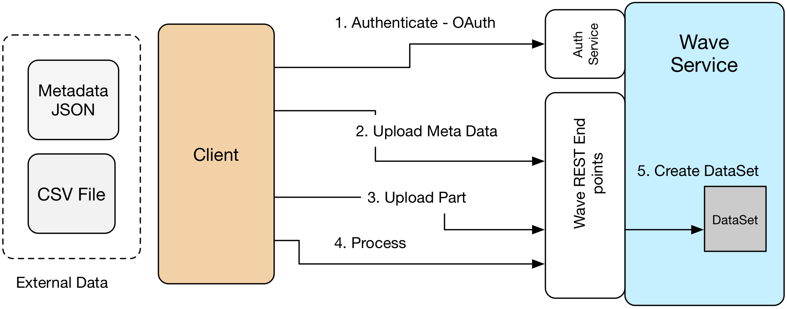
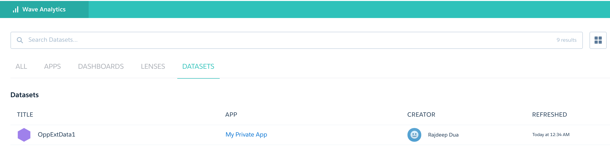

+++
date = "2016-07-29T16:18:23+05:30"
draft = true
title = "Wave : Learn how to use Wave External APIs to upload a Data Set"

+++

In this workshop we will learn how to use Wave REST APIs to upload a data set and its associated meta-data and create a DataSet.
We will be using Python as the Language to create the scripts which interact with the REST Endpoints

## Introduction ##
Wave is the analytics offering of Salesforce which allows Data Analysts as well users to upload and explore data in a new view. When we are dealing with data which is changing reapidly or there is a need to automate creating wave dashboards Wave APIs come in handy.

Diagram below shows High Level flow diagram on how Wave External Data APIs can be used to upload a csv file.



## Pre-Requisites

1. Python 3.x
2. git client
3. Wave Enabled Salesforce Developer Account

## Source Code
Before we start explaining how to use Python to build the app, let us clone the source code from github into appropriate directory of your machine

``` bash

$ git clone https://github.com/rajdeepd/force-rest-python/

```

Structure of the source code can be seen below

``` bash
|-- data
|   |-- test_file_v1.csv
|   `-- test_metadata_v1.json
|-- org
|   |-- __init__.py
|   `-- salesforce
|       |-- account
|       |-- __init__.py
|       |-- list_rest_api_versions.py
|       |-- util
|       |   |-- config_sample.yml
|       |   |-- config.yml
|       |   |-- __init__.py
|       |   `-- util.py
|       `-- wave
|           |-- delete_insights_external_data_part.py
|           |-- describe_resources.py
|           |-- get_insights_external_data_detail.py
|           |-- __init__.py
|           |-- insights_complete_upload_and_process.py
|           |-- insights_external_data_get_list.py
|           |-- insights_external_data_part_get_list.py
|           |-- insights_external_data.py
|           |-- insights_external_describe.py
|           |-- insights_upload_metadata.py
|           |-- insights_upload_part.py
|           |-- insights_upload_patch_process.py
|           |-- resources.py
|           `-- wave_util.py
|-- __pycache__
`-- README.md

```
## Use Case

We will take a Simple DataSet with three colums : Username, Organization and Badges and upload to Wave. You can browse the dataset at `force-rest-python/data/test_file_v1.csv`. 


## MetaData File
Wave External data API needs a meta data file which defines the structure of the data. This file has to be written in a JSON format. In our case it is a simple file with a format similar to listing below. You can fine the complete listing at [link to test_metadata_v1.json](https://github.com/rajdeepd/force-rest-python/blob/master/data/test_metadata_v1.json).

``` json
{
	"fileFormat": {
		"charsetName": "UTF-8",
		"fieldsEnclosedBy": "",
		"fieldsDelimitedBy": ",",
		"numberOfLinesToIgnore": 1
	},
	"objects": [{
		"connector": "CSVConnector",
		"description": "",
		"fullyQualifiedName": "trailhead badge count",
		"label": "badges",
		"name": "badges",
		"fields": [{
			"description": "",
			"fullyQualifiedName": "UserName",
			"label": "UserName",
			"name": "Name",
			"isSystemField": false,
			"isUniqueId": true,
			"isMultiValue": false,
			"type": "Text"
		}, 
		....
		....
		]
	}]
}

```
## Steps involved
We will implement the following Steps 

1. Get OAuth Access token from Force.com OAuth Endpoint
2. Upload metadata JSON to `/services/data/v36.0/sobjects/InsightsExternalData` using a HTTP POST
3. Upload Data file in parts to `/services/data/v36.0/sobjects/InsightsExternalDataPart` using a HTTP POST
4. Process the data file to be converted into a DataSet by making a HTTP PATCH request to `/services//services/data/v36.0/sobjects/InsightsExternalData/<id>`

## Generic Classes to get OAuth token


## Setup

Create a `util/config.yml` file from `util/config_sample.yml` file and fill in the values appropriately from salesforce.com developer account. These values of client_id, client_secret, username and password will be required to get OAuth request token.

``` bash

$ cd org/salesforce/util
$ cp config_sample.yml config.yml
$ cat config_sample.yml 

```
Update the `TODO` with appropriate values for `client_id`, `client_secret`, `username` and `password`.

``` bash

credentials:
    client_id: TODO
    client_secret: TODO
    username: TODO
    password: TODO
    host: ap2.salesforce.com
    wave_base_url: /services/data/v36.0/wave/
    base_url: /services/data/v36.0/sobjects/
    login_url: https://login.salesforce.com
    base_soql_url: /services/data/v36.0/query/?q=
    grant_service: /services/oauth2/token?grant_type=password

```
## Common Methods


File `org/salesforce/util.py` provides common methods for getting access token. Getting access token consists of following steps. We define a class Util in this file and add common methods as static in this file

### Get Access Token

* Load Credentials from `config.yml` into appropriate variables

    ``` python

    with open("util/config.yml", 'r') as ymlfile:
        cfg = yaml.load(ymlfile)

        cred = cfg['credentials']
        client_id = cred['client_id']
        client_secret = cred['client_secret']
        username = cred['username']
        password = cred['password']

    ```

* Connect to the OAuth2 token url `/services/oauth2/token`
* Create a new HTTP Connection Object

    ``` python

    def get_login_connection():
      conn = http.client.HTTPSConnection("login.salesforce.com")
      return conn

    ```
  
* Do a secure HTTP Post to the url with the credentials 

    ``` python

    conn.request("POST", "/services/oauth2/token", params, headers)

    ```
* Get the result body and Parse the json 
* Extract the access_token and return it 

Full code Listing shown below

``` python

def get_access_token():
	conn = get_login_connection()
	conn.request("POST", "/services/oauth2/token", params, headers)
	response = conn.getresponse()
	print(response.status, response.reason)
	data = response.read().decode('ascii')
	data_json = json.loads(data)
	print('access_token: ' + data_json['access_token'])
	return data_json

```

**Test OAuth Functionality**

Try following test script to make sure your OAuth 2.0 handshake is working properly. You can find the test code in the path `force-rest-python/org/salesforce/test/test_oauth_access_token.py`

``` python

from org.salesforce.util import util

if __name__ == "__main__":
    access_token = util.get_access_token()['access_token']
    print("access_token: " + access_token)

```

Output of the test code is listed below, shows the access token received from the server

``` bash

access_token: 00D280000013APV!ARkAQMDEtho5ExW...2qI_rm0HM.HFIHwp9Z_cShzb

```
## Class InsightsExternalData
We have created a class `InsightsExternalData` where all the lifecycle functions are listed. You can browse the source code [here](https://github.com/rajdeepd/force-rest-python/blob/master/org/salesforce/wave/insights_external_data.py)

``` python

class InsightsExternalData:

    def __init__(self):

    def upload_metadata(self, metadata):

    def upload_part(self,  data):

    def delete_external_data(self, id):

    def delete_external_data_part(self, id):

    def patch(self, id,  data):

    def describe(self):

    def get_detail(self, id):

```
## Upload Metadata File


First we will convert the Metadata file into a base64 encoded string and then do a Http POST. Following Steps are implemented in [insights_upload_metadata](https://github.com/rajdeepd/force-rest-python/blob/master/org/salesforce/wave/insights_upload_metadata.py).


1. Create a InsightsExternalData class
2. Read Metadata file and create a JSON

    ``` python

    def read_file(path):
	    local_file = open(path, 'r')
	    file_content = local_file.read()
	    return file_content

	input_str = read_file(_path)

    ``` 

3. Encode metadata file contents to base 64

   ``` python

   encoded_metadata = encode(input_str)

   ```

4. Create a dictionary with appropriate key and values, this will be the JSON body of HTTP request


5. Make the HTTP Request call 

   ``` python 

   insights_external_data.upload_metadata(metadata)

   ```

   Where source for function`upload_metadata(metadata)` can be found in the file [insights_upload_metadata.py](https://github.com/rajdeepd/force-rest-python/blob/master/org/salesforce/wave/insights_upload_metadata.py).

   ``` python

    def upload_metadata(self, metadata):
        data = util.create_sobject('InsightsExternalData', metadata)
        print(data)
        return data

   ``` 

6. Return the id from the returned JSON

Complete listing

``` python

def upload_metadata(_path, edge_mart_alias, _format, _operation, _action):
    insights_external_data = InsightsExternalData()
    input_str = read_file(_path)
    encoded_metadata = encode(input_str)
    metadata = {}
    metadata["Format"] = _format
    metadata["Operation"] = _operation
    metadata["Action"] = _action
    metadata["EdgemartAlias"] = edge_mart_alias
    metadata["MetadataJson"] = encoded_metadata.decode('utf-8')
    response_local = insights_external_data.upload_metadata(metadata)
    json_data = json.loads(str(response_local))
    return json_data['id']

if __name__ == "__main__":

    path = '/home/ubuntu/work/force-rest-python/data/test_metadata.json'
    format = 'csv'
    operation = 'Overwrite'
    action = 'None'
    edge_mart_alias = 'OppExtData1'
    response = upload_metadata(path, edge_mart_alias, 
    	format, operation, action)
    print(response)

```

Try running the program as shown below

``` bash

$ python3 org/salesforce/wave/insights_upload_metadata.py 

{"id":"06V280000008tLMEAY","success":true,"errors":[]}
06V280000008tLMEAY

```
The id received here will be used in next two steps

## Upload Data File

In this section we will learn how to upload a Part of Data File. Functionality is implemented in https://github.com/rajdeepd/force-rest-python/blob/master/org/salesforce/wave/insights_upload_part.py 

Complete Code Listing:

``` python

def upload_part(path, data_id, part_number):
    insights_external_data = InsightsExternalData()
    input_str = read_file(path)
    encoded_data = encode(input_str)
    data = {}
    data['InsightsExternalDataId'] = data_id
    data['PartNumber'] = part_number
    data['DataFile'] = encoded_data.decode('utf-8')
    _response = insights_external_data.upload_part(data)
    return _response

if __name__ == "__main__":
    path = '/home/ubuntu/work/force-rest-python/data/test_file.csv'
    id = ''
    part_number = '1'
    response = upload_part(path, id, part_number)
    print(response)

```

Make sure you replace string in id with the id received in upload metadata step (06V280000008tLMEAY).

``` bash 

$ python3 org/salesforce/wave/insights_upload_part.py

``` 
If the upload is successful, you will see an output similar to the listing below:

``` bash

{"id":"06W280000008sxNEAQ","success":true,"errors":[]}

```

## Process Data File

Last step is to process the upload data and meta data file. Here we need to pass the id of metadata return call as well as the json shown below.

``` json

{
    "Action": "Process"
}

``` 
Then we call `insights_external_data.patch(data_id, data)` function where a HTTP PATCH call is made.


Complete Code listing

``` python

if __name__ == "__main__":
    insights_external_data = InsightsExternalData()
    data_id = "06V280000008tLMEAY"
    data = {
        "Action": "Process"
    }
    response = insights_external_data.patch(data_id, data)
    print(response)

```

Executing the code


``` bash 

$ python3 org/salesforce/wave/insights_upload_patch_process.py

``` 
Once the patch process is complete you can check that Data Set is created in Wave Dashboardand check for the dataset name, which is `OpExData1` in our case.



## Complete Example
Finally we might want to put all the three steps in a single script. Here we are executing the following steps

1. Upload metadata
2. Upload data
3. Process uploaded data and metadata


``` python

from org.salesforce.wave.insights_upload_metadata import upload_metadata
from org.salesforce.wave.insights_upload_part import upload_part
from org.salesforce.wave.insights_external_data import InsightsExternalData


if __name__ == "__main__":
    meta_path = 
      '/home/ubuntu/work/force-rest-python/data/test_metadata_v1.json'
    format = 'csv'
    operation = 'Overwrite'
    action = 'None'
    edge_mart_alias = 'BadgeAnalysis_v1'
    id = upload_metadata(meta_path, edge_mart_alias, format, operation, action)
    print('id:' + id)

    path = '/home/ubuntu/work/force-rest-python/data/test_file_v1.csv'
    part_number = '1'
    response = upload_part(path, id, part_number)
    print("Part Upload Response:" + response)

    insights_external_data = InsightsExternalData()
    data = {
        "Action": "Process"
    }
    response = insights_external_data.patch(id, data)
    print("Completed Processing")

``` 

Execute using the following command

``` bash

$ python3 org/salesforce/wave/insights_complete_upload_and_process.py

``` 

Output


``` bash

{"id":"06V280000008tJJEAY","success":true,"errors":[]}
id:06V280000008tJJEAY
Part Upload Response:{"id":"06W280000008suPEAQ","success":true,"errors":[]}
Completed Processing

```

## Summary

In this workshop we learnt how to Use Wave External Data APIs with Python 3 and uploaded a DataSet along with its metadata.


